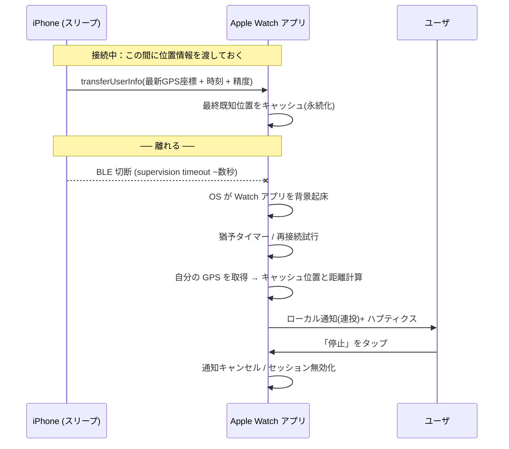
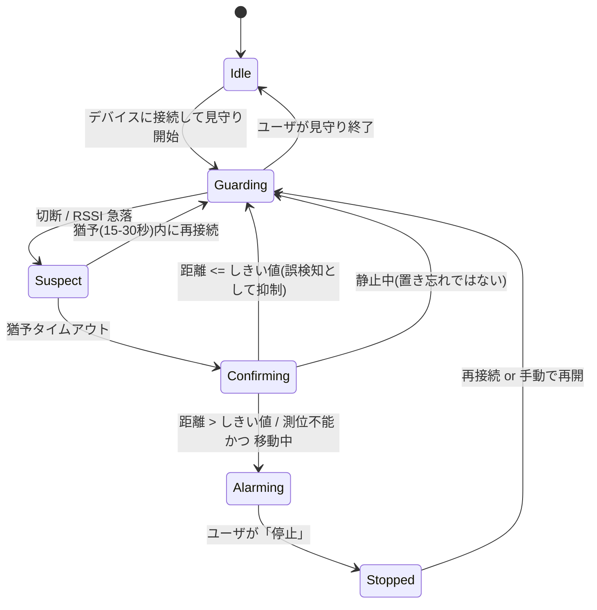
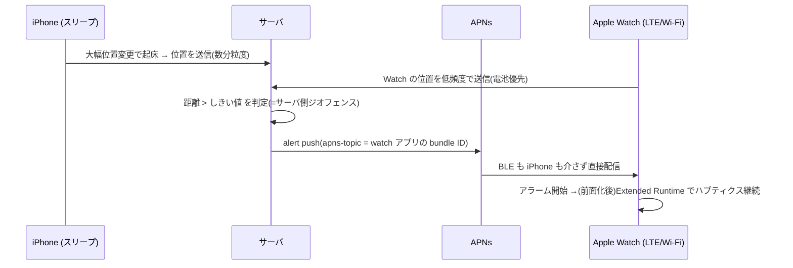
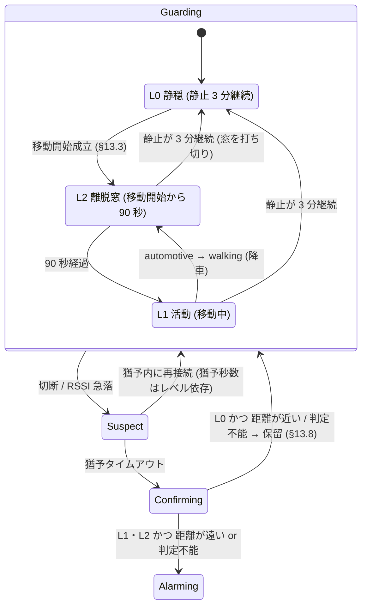
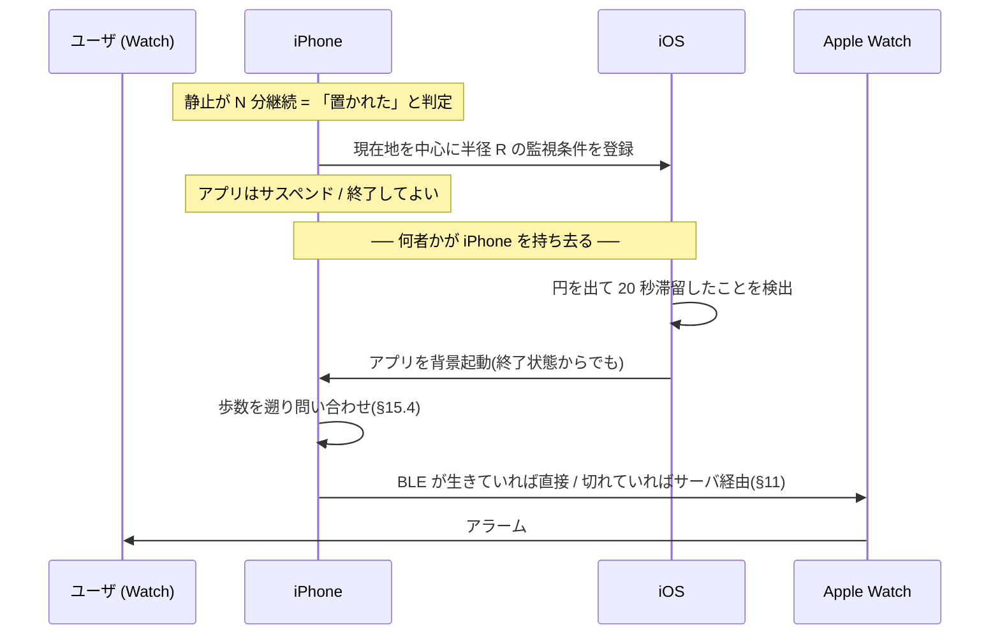

# iPhone スリープ中の Apple Watch アラーム — 方式検討

> 対象: `apple-watch/TuretetteWatch`(watchOS アプリ)+ 未実装の `ios/`(iPhone コンパニオン)
> 検討日: 2026-08-23(§0〜§16) / 追加調査: 2026-09-02(§17〜§19)
> 前提 watchOS 9.0+、iOS 16+

「iPhone がスリープ状態でも Apple Watch に通知を送り、ユーザが止めるまでアラームを鳴らす」
ための 2 方式(BLE 切断検知 / GPS 距離比較)を、watchOS の実際の制約に照らして検討する。

---

## 0. 結論(TL;DR)

- 1. **アラームの生成は必ず Apple Watch 側で行う。
  - ** iPhone 側からの通知は「iPhone と Watch がつながっている」ことが前提であり、切断・遠距離という今回の発報条件下では届かない(§1)。
  - したがって iPhone の役割は「BLE ペリフェラルとして接続を維持する」「切れる前に自分の位置をWatch へ渡しておく」の 2 つに限定される。どちらもスリープ中のバックグラウンドで実行可能。
- 2. **方式1(BLE 切断)を一次トリガ、方式2(GPS 距離)を確証フィルタとして併用する**のが最良。
  - 方式1 は即応性が高いが誤検知が多く、方式2 は誤検知に強いが単独では Watch を起床できない(watchOS にはジオフェンス／大幅位置変更の API が存在しない、§2.2)。
  - 両者は補完関係にある。
- 3. **「止めるまで鳴らす」は単一 API では実現できない。
  - ** 段階的に鳴らし続ける多段設計が必要(§7)。
  - entitlement 追加なしで実用になるのは「ローカル通知の連投→ ユーザ操作でアプリ前面化 → Extended Runtime Session で無限ハプティクス」の組み合わせ。
  - 理想形は Critical Alerts entitlement の取得(Apple への個別申請が必要)。
- 4. **watchOS のバックグラウンド BLE 起床は 24 時間で 5 回**という厳しい予算がある(§2.1)。
  - 「切れたら即アラーム」を無条件に実装すると 1 日で予算を使い切るため、予算管理の設計が必須。
- 5. 現行コードには、この設計に進む前に直すべきバグ・無効設定が数点ある(§9)。
- 6. **Apple Watch が GPS + Cellular モデルなら、上記に「サーバ中継」という第3の経路が加わる**(§11)。
  - §1 の「iPhone → Watch の通知経路は無い」はローカル経路に限った話で、Watch が自前の回線を持てば iPhone →サーバ→ APNs → Watch が成立し、BLE の背景起床予算もジオフェンス非対応も回避できる。
  - ただし方式1・方式2 の設計自体は変わらず、サーバ基盤とプライバシー方針の変更という重いコストが乗るため、**ローカル完結版を本線、サーバ版を上乗せ**とするのが妥当。
- 7. **GPS 距離(方式2)は「発報」ではなく「抑制」に使う**(§12)。
  - 位置で起床できず、下限しきい値が 100〜200m、屋内で測位できず、背景実行枠内に測位が返らない可能性が高い。
  - 一方「Bluetooth が切れただけ(OFF / 電池切れ / 遮蔽)」を黙らせる能力は方式1 に無い唯一の価値。
  - 判定は `遠い / 近い / 判定不能` の 3 値で返し、**判定不能は必ず「鳴る」側へ倒す**。
  - 「iPhone だけが動く」置き引きは方式2 では原理的に検出できない(§12.1-2)。埋められるのはサーバ経路のみ。
- 8. **モーション(移動開始)は、位置と同じく Watch を起床できない**(§13.4)。
  - よって「移動を始めたら検出モードへ移る」は、前面/拡張ランタイム中は即応、
    背景では**起床時に `queryPedometerData` / `queryActivityStarting` で過去へ遡る**、という二枚看板になる。
  - 遡り問い合わせはセンサを起こさないため、GPS と違って背景実行枠の中で完結できる。方式2 より扱いやすい。
  - 監視レベル L0 静穏 / L1 活動 / L2 離脱窓を **§6 の状態機械と直交**に持ち、猶予秒数と BAR 間隔を伸縮させる。
  - 「机に iPhone を置いて席を立つ」は、切断イベントを保留して**移動開始で成立させる遅延発報**で拾う(§13.8)。
- 9. **距離判定の主役は GPS ではなく `CMPedometer` の積算歩行距離にすべき**(§14)。
  - 経路長 L は変位 d の上界(`L ≥ d`)なので、**「L < しきい値 ⟹ 近い」は方向に依らず厳密に成立する**。
    GPS の「近い」が精度円ぶん曖昧なのに対し、こちらは保証になる。
  - しかも **屋内でも測れる / TTFF が無く背景枠内に返る / 電池を食わない / 検出下限が数十 m** と、
    §12 で挙げた GPS の欠点のほとんどが消える。→ **方式2 は「無くても成立する機能」に格下げできる**(§14.7)。
  - 発報側には経路長だけでなく**連続歩行時間**を併用する(その場を歩き回っても L は貯まるため)。
- 10. **watchOS の背景更新には「文字盤にコンプリケーションがあること」が事実上の前提**(§14.10)。
  - Dock 内で 1 時間に 1 回、コンプリケーションありで 1 時間に数回。**実質的な下限は 15 分**。
  - `HKObserverQuery` + 背景配信を使えば**歩数の書き込みで起床できる**が、同じ予算を共有する(§14.9)。
- 11. **iPhone も Core Motion では起床できない。** ただし iOS には代替経路が豊富にある(§15)。
  - **「置かれた地点に半径 100〜150m のジオフェンスを張り、出たら起きる」が盗難検知の実用解**(§15.3)。
    アプリが終了していても iOS が起こすため、Core Motion にできないことができる。
  - 起床後に「**歩数 0 なのに位置が動いた**」が取れれば、盗難の強い証拠になる(§15.4)。
  - **Apple Watch は iBeacon になれない**(watchOS は `CBPeripheralManager` のアドバタイズ非対応)。
- 12. **AirTag はモーションを検知しているが、外部に通知する手段は無い**(§16)。
  - 音を鳴らすだけで電波には乗らない。DULT の非所有者向け GATT にもモーション関連の命令は無い。
  - **識別子が約 15 分で回転するため、そもそも「自分の AirTag」を追跡対象にできない。**
  - 代わりに**モーション付きの汎用 BLE タグ**を使えば、タグ側 × Watch 側の動きの 2×2 で
    **置き忘れと盗難を、距離もしきい値も無しに区別できる**(§16.5)。
- 13. **「何 m で切れるか」は決まらない。切断は距離ではなく supervision timeout で起きる**(§17)。
  - 公称 10m、屋外で 30〜70m、屋内では 5〜15m。Apple 自身がレンジを数値で定義していない。
  - RSSI は静止していても 5〜10dB 揺れ、距離換算では 2〜3 倍の誤差になる。
  - **切断は「離脱の証拠」ではなく「離脱の疑いの発生」**でしかない。
  - `txPower = -59` / `n = 2.0` は自由空間の値。**実機で較正しないと 2m しきい値は根拠を持たない**(§17.6)。
- 14. **AlarmKit(iOS 26+)は本線には使えないが、盗難検知(§15.3)には使える**(§18.4)。
  - 消音・集中モードを貫通する鳴りっぱなしアラームが、**Critical Alerts の個別申請なしに**作れる。
  - ただし **iOS / iPadOS 専用で watchOS SDK が無い**ため、Watch 単独で鳴らす §7 の結論は変わらない。
- 15. **背景での切断検知は「役割」に依存する。iPhone はペリフェラル役だと切断を検知できない**(§19)★。
  - `CBPeripheralManagerDelegate` に切断に相当するメソッドが無く、
    背景起床も read / write / subscribe のみ。→ **案 A では検知責任は 100% Watch 側にある。**
  - Watch は切断で起きるが、それは**「再接続を試みるための短い枠」**であって
    通知を出すための枠とは限らない。ここが方式1 最大の未検証点(§19.7-1)。
  - SDK 確認により、**切断時刻が取れる `didDisconnectPeripheral:timestamp:`** の存在が判明。
    遡及判定(§13.8 / §14.4)の基準時刻にはこれを使うこと。
  - **`registerForConnectionEvents` は watchOS 6.0+ で使える**(§19.5-4)。
    背景 BLE 起床とは別系統なので、**Series 6 未満の現在の機体でも試せる可能性がある。**

---

## 1. 大前提：通知はどちらの端末で作るのか

「iPhone がスリープ状態のとき」という条件から、まず通知の生成場所を決める必要がある。

| 経路                                              | 成立するか        | 理由                                                   |
|---------------------------------------------------|-------------------|--------------------------------------------------------|
| iPhone がローカル通知を出し、Watch へミラーリング | **不可**          | 通知ミラーリングは iPhone↔Watch のリンク経由。         |
|                                                   |                   | 方式1 の発報条件はそのリンクが切れた状態そのもの。     |
|                                                   |                   | 方式2 でも「離れている」=リンク圏外である可能性が高い |
| サーバから APNs で Watch へ直接プッシュ           | 条件付きで可能    | Watch が単独で Wi-Fi/セルラーに接続している必要があり、サーバ・アカウント基盤も必要。 |
|                                                   |                   | 圏外では落ちるため単独では成立しないが、**GPS + Cellular モデルではローカル版の弱点を大きく補える**(詳細は §11) |
| **Watch アプリが自分でローカル通知を出す**        | **これしかない**  | ネットワーク不要。検知も発報も Watch 内で完結する |

**帰結：検知ロジックとアラームは Watch 側に置く。

- ** 現行の `BLEManager` / `AlarmManager` がWatch 側にある構成は正しい。
- iPhone 側アプリは「ペリフェラル役」と「位置の事前送信役」に徹する。
- (Watch が自前の回線を持てる場合の上乗せ設計は §11 を参照。ただしその場合も本節のローカル完結版は残す。)



---

## 2. プラットフォーム制約(調査結果)

設計判断の前提となる、公式ドキュメント / WWDC で確認した事実。

### 2.1 watchOS のバックグラウンド BLE

WWDC22「Get timely alerts from Bluetooth devices on watchOS」より。

| 項目                      | 内容 |
|---------------------------|------|
| 必要な設定                | Watch アプリの Info.plist に `UIBackgroundModes = [bluetooth-central]`(iOS 側の capability UI ではなく Watch ターゲットの plist を直接編集する) |
| 動作要件                  | **watchOS 9 以降 かつ Apple Watch Series 6 以降** |
| 起床のきっかけ            | 接続済みペリフェラルからの **GATT characteristic の notify / indicate** |
| **背景実行の予算**        | **24 時間のローリングウィンドウで 5 回**(watchOS 9) |
| 予算のリセット            | ユーザがアプリを操作する、または 24 時間経過 |
| 1 回あたりの実行時間      | 「ごく短い」。ユーザに通知を出すには足りるが、重い処理は不可 |
| 予算枯渇時                | `LeGattExceededBackgroundNotificationLimit` が通知され、watchOS 8 相当の挙動(背景接続なし・Background App Refresh のみ)に戻る |
| 推奨 connection interval  | 背景動作時は 150ms 以上 |
| 同時接続数                | watchOS は CoreBluetooth 接続 2 台まで |

> **設計上の含意**：「BLE イベントで起きて鳴らす」は 1 日 5 回しか保証されない。
> 誤検知で 1 回使うたびに、本当に必要な場面の弾が減る。
> §3.3 の誤検知抑制と、 §6 の予算管理は必須。
> なお `didDisconnectPeripheral` による切断検知も同じ背景実行枠を消費するとみなして設計するのが安全。
>
> **★ 補正(§19.4 / §19.6)**: 切断で起きること自体は確認できたが、その枠は
> 「**再接続を試みるための短い枠**」と位置づけられており、notify による「通知を出すための枠」とは
> 別物に読める。**その枠でローカル通知を積めるかは未検証**(§19.7-1)。上の保守的な前提は維持する。

### 2.2 watchOS の位置情報 — ジオフェンスが使えない

「最後の位置から R メートル離れたら起床」というジオフェンス実装は **watchOS では不可能**。
主要 API の対応プラットフォームを確認した結果：

| API | watchOS | 備考 |
|---|---|---|
| `startMonitoring(for: CLRegion)`(ジオフェンス) | **非対応** | iOS / macOS のみ。iOS 27 で deprecated |
| `startMonitoringSignificantLocationChanges()` | **非対応** | iOS / macOS のみ |
| `CLMonitor` + `CircularGeographicCondition`(iOS 17+ の後継) | **非対応** | iOS のみ |
| `requestLocation()`(単発取得) | 対応 | 実行中のアプリからのみ |
| `startUpdatingLocation()` | 対応(watchOS 3.0+) | 背景継続には `allowsBackgroundLocationUpdates = true` + `WKBackgroundModes = [location]` |
| `CLBackgroundActivitySession` + `CLLocationUpdate.liveUpdates`(watchOS 10+) | 対応 | 前面で開始する必要あり。要実機検証 |

さらに `startUpdatingLocation()` の注意書きにあるとおり、**アプリがサスペンド／終了すると位置
イベントの配信は止まる**。iOS では Always 認可 + SLC / visits / region 監視があればアプリが
背景起動されるが、**watchOS にはその 3 つがどれも無い**。

> **設計上の含意**：方式2 は**単独では成立しない**。位置情報で Watch を叩き起こす手段が
> 無いため、方式2 は「何か別の理由で起きたときに、鳴らすべきかを判断する材料」として使う。
> 起床のきっかけは (a) BLE イベント、(b) Background App Refresh、(c) WatchConnectivity 受信、
> (d) ユーザの操作、のいずれかに限られる。

### 2.3 「鳴らし続ける」ための実行時間 — Extended Runtime Session

`WKExtendedRuntimeSession` は「アプリが前面でなくなっても動き続ける」ための唯一の正規手段。

| セッション種別 | `WKBackgroundModes` の値 | 実行形態 | 最大時間 | 予約可否 |
|---|---|---|---|---|
| Self care | `self-care` | 前面維持 | 10 分 | 不可 |
| Mindfulness | `mindfulness` | 前面維持 | 1 時間 | 不可 |
| Physical therapy | `physical-therapy` | バックグラウンド | 1 時間 | 不可 |
| Smart alarm | `alarm` | バックグラウンド | 30 分 | **可**(36 時間先まで) |
| Underwater depth | `underwater-depth` | バックグラウンド | — | 不可 |
| (Workout) | `workout-processing` | バックグラウンド | 実質無制限 | — |

共通の制約：

- **拡張ランタイムのセッション種別はアプリごとに 1 つだけ**(`workout-processing` とは併用可)。
- **`start()` / `start(at:)` は必ず `WKApplicationState.active`(前面)で呼ぶ必要がある。**
- 画面が消えていても実行が続き、Bluetooth 通信・ハプティクス・サウンドを継続できる。
- `notifyUser(hapticType:repeatHandler:)` で**繰り返しハプティクス**を鳴らせる。
  `repeatHandler` が次回までの秒数を返す限り鳴り続けるため、「止めるまで鳴らす」を素直に書ける。
- Smart alarm は `start(at:)` で予約 → システムがアプリを再起動 → `notifyUser` を必ず呼ぶ必要が
  あり、呼ばないとシステムが警告を出して以後のセッションを無効化しようとする。

> **重要な帰結**：Smart alarm の再予約も「前面で」しか行えないため、
> 「30 分後の smart alarm を背景で予約し続けて常駐する」という設計は**成立しない**。
> Extended Runtime Session は「ユーザが前面で見守りを開始した」時点でのみ張れる。

### 2.4 通知でどこまで押し切れるか

| 手段 | 消音/集中モードの貫通 | 追加要件 |
|---|---|---|
| 通常のローカル通知 | しない | なし |
| `interruptionLevel = .timeSensitive` | 集中モードを貫通 | Time Sensitive Notifications capability(Xcode で自己付与可) |
| `interruptionLevel = .critical` + `UNNotificationSound.defaultCritical` | **消音スイッチ・おやすみモードも貫通、画面点灯、音量固定** | `com.apple.developer.usernotifications.critical-alerts` entitlement — [Apple への個別申請](https://developer.apple.com/contact/request/notifications-critical-alerts-entitlement/) が必要で、承認対象は極めて限定的。ユーザ許可も `.criticalAlert` オプションで別途取得 |

その他の実務上の制限：

- `UNTimeIntervalNotificationTrigger(timeInterval:repeats: true)` は **60 秒以上でないと繰り返せない**。
  数秒間隔で鳴らすには一発ごとに別リクエストを積む必要がある。
- **未配信の通知リクエストはアプリあたり 64 件が上限**(超過分は捨てられる)。
  例：5 秒間隔 × 60 件 = 約 5 分間の鳴動が 1 バッチの限界。
- `UNNotificationCategory` にアクションを登録すれば、通知から直接「停止」を押せる。

### 2.5 WatchConnectivity

- Watch 側の `WCSession.isReachable` の定義は「iPhone が圏内で通信可能、**かつ Watch アプリが
  前面、または高優先度のバックグラウンド(ワークアウト中など)で動作している**」。
  iPhone アプリ側が起動している必要はない(Watch からの送信で iOS アプリが背景起動されるため)
  が、**Watch アプリが通常のバックグラウンドにいる間は常に false** になるため、
  **背景での検知トリガーには使えない**。前面にいるときの補助表示に留める。
  加えて `sessionReachabilityDidChange(_:)` は取りこぼし・誤発火の報告が多い。
  また「圏内」は Wi-Fi 経由でも成立するため、自宅内では離れても圏内判定になりやすい。
- `transferUserInfo(_:)` は iPhone がスリープ中でもキューイングされて配信され、
  **Watch アプリを `WKWatchConnectivityRefreshBackgroundTask` で背景起床できる**。
  → 位置情報の事前共有はこれで行う(`updateApplicationContext` は上書きされるが最新値だけ欲しい
  今回の用途にはむしろ適する)。
- 既知の落とし穴：最初の `WKWatchConnectivityRefreshBackgroundTask` を受け取った後、
  以降のメッセージが既定のデリゲート経路で処理されてタスクが紐付かなくなることがある。
  `hasContentPending` を監視し、処理し終えてから `setTaskCompleted` すること。

---

## 3. 方式1：BLE 接続の切断で検知する

### 3.1 トポロジの選択

| 案          | 構成                                                                                            | 評価 |
|-------------|-------------------------------------------------------------------------------------------------|---|
| **A(推奨)** | iPhone = `CBPeripheralManager`(アドバタイズ+characteristic)、Watch = `CBCentral` として接続維持 | 接続を張りっぱなしにするので、iPhone がスリープでも OS が iOS アプリを起こしてくれる。 |
|             |                                                                                                 | 切断は双方が数秒で検知。watchOS の背景 BLE 起床(§2.1)が効く唯一の構成 |
| B           | `WCSession.isReachable` の変化を見る                                                            | 実装は最小だが、**Watch アプリが前面のときしか true にならない**(§2.5)ため背景検知には使えない。
|             |                                                                                                 | 信頼性も低く、Wi-Fi 経由でも到達扱いになる。前面表示の補助のみ |
| C           | Watch ⇔ BLE タグ(iPhone を介さない)                                                             | 現行実装の想定。タグ側の仕様に依存するが、notify を出せるタグなら A と同じ枠組みで動く |

案 A の iPhone 側要件：

- `UIBackgroundModes = [bluetooth-peripheral]`。バックグラウンドでのアドバタイズはサービス UUID が「オーバーフロー領域」に移り、ローカル名も載らない。
  - **Watch 側はサービス UUID を明示してスキャンすること**(`scanForPeripherals(withServices:)`)。
- `CBPeripheralManagerOptionRestoreIdentifierKey` による状態復元を入れる。
  - ただし**ユーザが手動でアプリを終了(スワイプで kill)した場合は OS が復帰させない**。
    - この場合の救済は「Watch 側で接続できないことを検知して知らせる」しかない。
- Watch を起こすため、`CBMutableCharacteristic` に `.notify` を持たせ、接続中に定期的(例：数分に 1 回)または状態変化時に `updateValue` する。
  - これが §2.1 の起床トリガになる。心拍のような高頻度更新は予算を焼き切るので厳禁。

> **★ 補正(§19.3)**: それだけではない。**ペリフェラル役の iPhone は、そもそも切断を検知できない。**
> `CBPeripheralManagerDelegate` に `didDisconnect` に相当するメソッドが無く、
> `bluetooth-peripheral` で背景起床するのは read / write / subscribe のみである。
> → **案 A において「離れた」を検知する責任は 100% Watch 側にある。**
> iPhone は自分が置き去りにされたことを知る手段を持たない。

### 3.2 検知の流れ

```
接続維持(Watch = Central)
  ├─ 正常時：ハートビート characteristic の notify を低頻度で受信
  ├─ 切断時：
  │    ├─ CBCentralManagerDelegate.centralManager(_:didDisconnectPeripheral:error:)
  │    │    → OS が Watch アプリを背景起床(State Restoration 経由)
  │    └─ 猶予フェーズへ
  └─ 猶予フェーズ(15〜30 秒)
       ├─ connect(peripheral) で自動再接続を試行(CoreBluetooth はタイムアウトなしで待つ)
       ├─ 再接続できた → 誤検知として破棄、監視へ復帰
       └─ 猶予切れ → 確証フェーズ(=方式2)へ
```

BLE の切断検知そのものは、Link Layer の **supervision timeout(実測で概ね数秒)** で起きる。
即応性は十分。問題は精度側にある。

> **★ 実装上の必須事項(§19.5)**
> - 旧来の `didDisconnectPeripheral:error:` ではなく、
>   **`centralManager:didDisconnectPeripheral:timestamp:isReconnecting:error:`** を使う
>   (可用性注釈が無く watchOS 9.0 ターゲットのままビルドできる。§19.5-2 の訂正を参照)。
>   背景起床は切断から数秒遅れるため、**切断時刻が取れないと §13.8 / §14.4 の遡及判定の基準時刻がずれる。**
> - 上図の「自前で `connect` を張り直す」猶予処理は、
>   **`CBConnectPeripheralOptionEnableAutoReconnect`(watchOS 10+)** で OS 側に寄せられる可能性がある。
>   ただし §17.5 のレンジ縮小挙動との相互作用は未確認。

### 3.3 誤検知の要因と対策

BLE の切断は「離れた」以外の理由でも日常的に起きる。
ここを潰さないと、§2.1 の 5 回/24h 予算を誤報で使い切って肝心なときに鳴らないアプリになる。

| 切断の原因                                    | 見分け方                                              | 対応 |
|-----------------------------------------------|-------------------------------------------------------|------|
| 電波の遮蔽・干渉(角を曲がった、体が挟まった)  | 数秒で再接続できる                                    | 猶予タイマー(15〜30 秒)で吸収 |
| iPhone の Bluetooth を OFF にした             | 再接続要求が即失敗し続ける                            | 位置が近ければ鳴らさない(方式2 で確証) |
| iPhone の電池切れ・再起動                     | 同上                                                  | 同上。加えて「最後の受信から N 分」を通知文に含めて誤解を防ぐ |
| iPhone アプリがユーザに kill された           | 復元されない                                          | 前面復帰時に「見守りが止まっています」と警告 |
| **本当に置き忘れた／はぐれた**                | 再接続不能 かつ 位置が離れている かつ ユーザが移動中  | **発報** |

追加の抑制条件(現行の `MotionManager` を活かす)：

- **ユーザが静止しているなら鳴らさない。** 置き忘れは「離れる」動作を伴う。
  `CMMotionActivity` が stationary のまま切れたのは、iPhone 側の都合である可能性が高い。
- **切断直前の RSSI トレンド**を見る。減衰しながら切れたなら距離起因、
  高 RSSI から突然切れたなら障害起因の可能性が高い。移動中央値でノイズを落として判定する。

---

## 4. 方式2：最後に報告された GPS 位置との距離で検知する

### 4.1 位置情報をどう渡すか(切れる前に渡しておく)

離れてからでは通信できないので、**接続中に継続的に最新位置を Watch へ push しておく**のが基本。

**iPhone 側(スリープ中でも動く経路)**

```swift
// 省電力：大幅位置変更のみ。サスペンド・強制終了後でもアプリを背景起動できる(iOS のみ)
locationManager.allowsBackgroundLocationUpdates = true
locationManager.startMonitoringSignificantLocationChanges()

func locationManager(_ m: CLLocationManager, didUpdateLocations locs: [CLLocation]) {
    guard let loc = locs.last else { return }
    WCSession.default.transferUserInfo([
        "lat": loc.coordinate.latitude,
        "lon": loc.coordinate.longitude,
        "acc": loc.horizontalAccuracy,   // 精度円の半径(m)
        "ts" : loc.timestamp.timeIntervalSince1970
    ])
}
```

- 大幅位置変更は概ね 500m / 数分の粒度。置き忘れ検知(数十〜数百 m 判定)には十分。
- 併せて、**BLE 接続中は characteristic の read でも現在位置を返せる**ようにしておくと、
  Watch 側が「切れる直前の値」を能動的に取りに行けて鮮度が上がる。
- 位置が動かない(=iPhone が机の上にある)ときは SLC が発火しないので、
  「一定時間ごとに 1 回は送る」ハートビートも入れて鮮度と生存確認を兼ねる。

**Watch 側**

```swift
func session(_ s: WCSession, didReceiveUserInfo userInfo: [String: Any]) {
    LastKnownFix.save(from: userInfo)   // UserDefaults へ永続化(背景終了に耐える)
}
```

AppDelegate の `handle(_:)` に `WKWatchConnectivityRefreshBackgroundTask` の分岐を追加する
(現行コードには無い、§9)。

**BLE タグ(GPS 非搭載)の場合**：タグ自身は位置を報告できないので、
「**Watch がタグを最後に見た地点=そのときの Watch の位置**」を最終既知位置として記録する。
接続中に定期的に Watch の位置を上書き保存しておけばよい。

### 4.2 Watch 側の距離判定

```swift
// 起床のきっかけがあったときにだけ 1 回取る(常時測位は電池を焼く)
locationManager.requestLocation()

func locationManager(_ m: CLLocationManager, didUpdateLocations locs: [CLLocation]) {
    guard let watchLoc = locs.last, let fix = LastKnownFix.load() else { return }

    let age = Date().timeIntervalSince(fix.timestamp)
    let raw = watchLoc.distance(from: fix.location)          // 大円距離(m)
    let margin = watchLoc.horizontalAccuracy + fix.accuracy  // 双方の精度円を差し引く
    let effective = raw - margin

    switch (effective, age) {
    case let (d, a) where d > threshold && a < maxAge:  fire()          // 確実に離れている
    case let (d, _) where d <= threshold:               suppress()      // 近い → 誤検知
    default:                                            fireCautiously() // 位置が古い → 文面を弱める
    }
}
```

判定パラメータの目安：

| パラメータ | 推奨値 | 根拠 |
|---|---|---|
| `threshold`(距離しきい値) | **100〜200 m**(ユーザ設定可) | Apple Watch の GPS 誤差は屋外で 5〜20 m、市街地や屋内ではそれ以上。BLE の 2m 判定と同じ感覚では誤検知だらけになる |
| `maxAge`(位置の鮮度) | 10 分 | SLC の粒度と釣り合う。これを超えたら「離れた」と断定せず注意喚起に留める |
| 測位タイムアウト | 15〜30 秒 | 屋内では測位に失敗する。失敗時は方式1 の判定にフォールバック |

### 4.3 方式2 の限界

- **単独で起床できない**(§2.2)。必ず方式1 か Background App Refresh に乗せる必要がある。
- 屋内・地下では測位できないか誤差が数百 m に膨らむ。`horizontalAccuracy` を見て、
  精度が悪すぎる(例：> 100 m)フィックスは判定に使わない。
- 測位そのものが電池を食う。**イベント駆動で単発取得**に徹し、常時測位はしない。
- 「iPhone を置いた場所で自分も座っている」ケースは距離 0 なので正しく鳴らない(望ましい挙動)。

---

## 5. 方式1 と方式2 の比較

| 観点 | 方式1(BLE 切断) | 方式2(GPS 距離) |
|---|---|---|
| 検知の速さ | 数秒(supervision timeout) | 位置更新の粒度に依存(数分) |
| 検知できる距離 | 約 10〜30 m(BLE 到達範囲) | しきい値次第(100 m〜) |
| Watch を起床できるか | **できる**(背景 BLE、5回/24h) | **できない**(watchOS にジオフェンス無し) |
| 誤検知しやすさ | 高い(遮蔽・干渉・電池切れ・Bluetooth OFF) | 低い(ただし測位失敗・精度劣化あり) |
| 屋内での信頼性 | 中(壁で切れやすい=過検知) | 低(測位できない) |
| 電池消費 | 小(接続維持は安価) | 中〜大(測位のたびに GPS 起動) |
| iPhone スリープ中の可用性 | 可(BLE 背景モードで OS が起こす) | 可(SLC で背景起動 → transferUserInfo) |
| タグ(GPS 無し)対応 | そのまま可 | 「最後に見た地点」で代替可 |

**単独採用の可否**：方式1 は単独で成立するが誤報が多い。方式2 は単独では成立しない。
→ **方式1 で起きて、方式2 で確かめる**という組み合わせが唯一まともに動く構成。

---

## 6. 推奨アーキテクチャ：二段トリガ



各状態でやること：

| 状態 | Watch がやること | 消費する背景予算 |
|---|---|---|
| Guarding | BLE 接続維持、低頻度 notify 受信、位置キャッシュ更新 | ハートビート 1 回 |
| Suspect | 再接続試行、猶予タイマー。この間は無音 | 切断起床 1 回 |
| Confirming | `requestLocation()`、再接続可否、モーション状態確認 | 同じ起床枠の中で完結させる |
| Alarming | 通知連投 +(前面化後)Extended Runtime Session でハプティクス継続 | — |

**背景予算(5 回/24h)の管理**

- `LeGattNearBackgroundNotificationLimit` / `LeGattExceededBackgroundNotificationLimit` を購読し、
  残弾が少ないときは「切断即起床」をやめて Background App Refresh 主体に落とす。
- 予算はユーザ操作でリセットされるので、アラーム停止操作そのものが回復の契機になる。
- 残弾切れの状態を UI に出す(「省電力のため検知間隔が長くなっています」)。

**強化モード(任意)**：ユーザが前面で「これから 1 時間見守る」と明示的に開始した場合に限り、
`WKExtendedRuntimeSession`(physical-therapy = 背景 1 時間)を張れば、予算に縛られず
確実に監視できる。通勤・買い物の 1 時間をカバーする用途に合う。ただし §10 の審査リスクあり。

---

## 7. 「ユーザが止めるまで鳴らす」の実装

単一の API では実現できないため、3 段構えにする。

### 段階 1：即時のローカル通知(Watch 上で完結)

```swift
let content = UNMutableNotificationContent()
content.title = "iPhone が離れました"
content.body  = "最後の位置から 180m。置き忘れていませんか？"
content.sound = .default
content.interruptionLevel = .timeSensitive   // 集中モードを貫通
content.categoryIdentifier = "TURETETTE_ALARM"  // 「停止」アクション付き
content.threadIdentifier   = "turetette.alarm"  // 通知センターで束ねる
```

### 段階 2：通知の連投で鳴らし続ける

`repeats: true` は 60 秒以上でないと使えず、未配信リクエストは 64 件が上限なので、
**短い間隔の一発通知を積む**。

```swift
// 5 秒間隔 × 48 発 ≒ 4 分間鳴り続ける(64 件上限に余裕を残す)
for i in 0..<48 {
    let trigger = UNTimeIntervalNotificationTrigger(
        timeInterval: TimeInterval(1 + i * 5), repeats: false)
    center.add(UNNotificationRequest(
        identifier: "turetette.alarm.\(i)", content: content, trigger: trigger))
}
```

- 「停止」時は `removePendingNotificationRequests` と `removeDeliveredNotifications` の両方を、
  **全 ID に対して**呼ぶ(現行実装は ID 1 個しか消していない、§9)。
- 1 バッチが尽きる前にアプリが背景で生きていれば次バッチを積み直す。生きていない場合は
  段階 3 に委ねる。
- 通知センターが 48 件で埋まるので、`threadIdentifier` で束ね、停止時に必ず全消しする。

### 段階 3：アプリ前面化後の無限ハプティクス

ユーザが通知をタップする／手首を上げてアプリが前面に来たら、**そこで初めて**
Extended Runtime Session を張れる(`start()` は前面でしか呼べない、§2.3)。

```swift
final class AlarmRuntime: NSObject, WKExtendedRuntimeSessionDelegate {
    private var session: WKExtendedRuntimeSession?

    func begin() {                       // 必ず WKApplicationState.active で呼ぶ
        let s = WKExtendedRuntimeSession()
        s.delegate = self
        s.start()
        session = s
    }

    func extendedRuntimeSessionDidStart(_ s: WKExtendedRuntimeSession) {
        // 止めるまで 2 秒おきに鳴らし続ける
        s.notifyUser(hapticType: .notification) { type in
            type.pointee = .notification
            return 2.0                   // 次回までの秒数。返し続ける限り継続
        }
    }

    func stop() { session?.invalidate(); session = nil }
}
```

これにより**画面が消えてもハプティクスが継続**し、「停止」を押すまで鳴り続ける
(セッション上限まで：physical-therapy / mindfulness なら 1 時間)。

### 段階 0(理想形)：Critical Alert

> **★ 補正(§18.4)**: iOS 26 で **AlarmKit** が追加され、
> 個別申請なしに消音・集中モードを貫通するアラームが作れるようになった。
> ただし **iOS / iPadOS 専用で watchOS SDK が無い**ため、
> **Watch 上で鳴らす本節の結論は変わらない。** 使えるのは §15.3 の盗難検知(iPhone 側で鳴らす)のみ。

`com.apple.developer.usernotifications.critical-alerts` を取得できれば、
消音・おやすみモードを貫通し、画面を点灯させ、固定音量で鳴らせる。
本アプリの用途(置き忘れ・はぐれ防止=安全)は申請の名目としては筋が通るが、
**承認対象は極めて限定的**なので、これ**前提の設計にはしない**。段階 1〜3 に上乗せする位置づけ。

### 手段の比較

| 手段 | 画面消灯時 | 継続時間 | 追加要件 | 審査/申請リスク |
|---|---|---|---|---|
| ローカル通知 1 発 | ○ | 単発 | なし | 低 |
| 通知の連投(48〜64 発) | ○ | 実質 4〜5 分/バッチ | なし | 低 |
| Time Sensitive | ○(集中モード貫通) | 同上 | capability 自己付与 | 低 |
| Critical Alert | ○(消音も貫通) | 同上 | **Apple への申請** | 高(承認制) |
| 前面 + `Timer` + `WKInterfaceDevice.play()` | **×**(消灯で停止) | 前面の間だけ | なし | 低 |
| Extended Runtime(physical-therapy 等) | ○ | 最大 1 時間 | `WKBackgroundModes`、前面で開始 | 中(用途との整合) |
| Extended Runtime(smart alarm) | ○ | 30 分 | 前面で 36h 以内を予約 | 中(イベント駆動に不向き) |
| `HKWorkoutSession` 常駐 | ○ | 実質無制限 | `workout-processing` | **高**(電池・アクティビティ汚染・審査) |

> 現行の `AlarmManager` は「前面で Timer + `play()`」+「背景ならローカル通知 1 発」なので、
> **画面が消えた瞬間に鳴り止む**。要件「止めるまで鳴らす」を満たしていない。

---

## 8. 実装タスク(分解)

### Tier 0 / Watch アプリ

| # | 内容 | 対象 |
|---|---|---|
| 1 | `WKBackgroundModes` の無効値 `self-contained` を除去(§9-1) | `Info.plist` |
| 2 | 位置情報の使用目的説明 `NSLocationWhenInUseUsageDescription` 追加 | `Info.plist` |
| 3 | 背景スキャン用にサービス UUID を定義し `scanForPeripherals(withServices:)` へ変更 | `BLEManager` |
| 4 | 復帰時の再接続を `retrievePeripherals(withIdentifiers:)` ベースに変更 | `BLEManager` |
| 5 | RSSI の移動中央値フィルタ+適応ポーリング(前面 1s / 背景はイベント駆動) | `BLEManager` |
| 6 | 背景予算の監視(`LeGattNear/Exceeded...` 通知の購読) | `BLEManager` |
| 7 | **新規** 状態機械(Guarding/Suspect/Confirming/Alarming)と猶予タイマー | `ProximityCoordinator`(新規) |
| 8 | **新規** 単発測位と距離判定 | `LocationManager`(新規) |
| 9 | **新規** `WCSession` 受信と最終既知位置の永続化 | `ConnectivityManager` / `LastKnownFix`(新規) |
| 10 | `handle(_:)` に `WKWatchConnectivityRefreshBackgroundTask` 分岐を追加 | `AppDelegate` |
| 11 | 通知連投+全 ID 一括キャンセル、`UNNotificationCategory`(停止アクション) | `AlarmManager` |
| 12 | `WKExtendedRuntimeSession` によるハプティクス継続 | `AlarmManager` |
| 13 | アラーム状態の永続化(背景終了しても復帰時に鳴動継続) | `AlarmManager` |
| 14 | しきい値(距離・猶予秒数)の設定画面 | `Views/`(新規) |

### Tier 0 / iPhone アプリ(新規 `ios/`)

| # | 内容 |
|---|---|
| 1 | `CBPeripheralManager`：サービス/characteristic 公開、`bluetooth-peripheral` 背景モード、状態復元 |
| 2 | 低頻度ハートビート notify(Watch の背景起床トリガー、間隔は予算と要相談) |
| 3 | `startMonitoringSignificantLocationChanges()` + `transferUserInfo` で位置を Watch へ push |
| 4 | 位置 characteristic の read 対応(Watch から能動取得できるように) |
| 5 | `WKCompanionAppBundleIdentifier`(現在 `com.turetette`)と Bundle ID を一致させる |

### Tier 1(ネットワーク経由・任意、§11.4)

| # | 内容 |
|---|---|
| 1 | Watch アプリの独立 APNs 登録(`apns-topic` = watch アプリの bundle ID) |
| 2 | `AppDelegate.handle(_:)` に `WKURLSessionRefreshBackgroundTask` 分岐を追加 |
| 3 | iPhone: 大幅位置変更で起床 → background `URLSession` でサーバへ位置を送信 |
| 4 | サーバ: 距離判定(サーバ側ジオフェンス)と alert push の送出、停止の同期 |
| 5 | 二重発報の dedupe(イベント ID)とアラーム停止のサーバ通知 |
| 6 | プライバシー: 同意 UI、保存期間・削除手段、README と Info.plist の文言更新、プライバシーラベル |

---

## 9. 現行コードで先に直すべき点

1. **`WKBackgroundModes = [self-contained]` は無効値。** 正当な値は `workout-processing` /
   `self-care` / `mindfulness` / `physical-therapy` / `alarm` / `underwater-depth` のみ。
   Background App Refresh 自体はこのキー無しでも使えるので、いまは削除でよい。
   Extended Runtime Session を導入する段で適切な値を入れる。
2. **`BLEManager.performBackgroundRSSICheck()` の未接続分岐が発火しない。**
   `didDisconnectPeripheral` で `isOutOfRange = false` にリセットしているため、
   その後の `if isOutOfRange { sendOutOfRangeNotification(...) }` は常に false。
   「切れている」ことと「離れている」ことを別のフラグに分離する必要がある。
3. **`scanForPeripherals(withServices: nil)` は背景では動作しない。** 背景スキャンには
   サービス UUID の明示が必須。State Restoration 後の復帰も
   `retrievePeripherals(withIdentifiers:)` で行うべき。
4. **`Timer` ベースの 1 秒 RSSI ポーリングは背景で止まる**うえ、前面でも電池に厳しい。
   イベント駆動+適応間隔に変更する。
5. **単発 RSSI での距離判定はノイズが大きい。** 2m しきい値を素の RSSI 1 サンプルで
   判定すると頻繁に振動する。中央値フィルタ+ヒステリシス(例：出 2.5m / 復帰 1.5m)を入れる。
6. **`AlarmManager` の通知は 1 発のみ**=「止めるまで鳴る」を満たさない(§7)。
7. **アラーム状態が永続化されていない。** 背景でアプリが終了されると `isAlarmActive` が
   失われ、前面復帰時にハプティクスが再開されない。
8. `ContentView` の `.onReceive` 経由の発火は前面前提。実際の発報経路は
   `ProximityCoordinator` に集約し、View は表示だけにするのが望ましい。

---

## 10. 未検証事項・リスク

| # | 項目 | 内容 |
|---|---|---|
| 1 | 実機検証が必須 | 背景 BLE / WatchConnectivity はシミュレータで再現しない。Series 6 以降の実機が必要 |
| 2 | 切断イベントの予算消費 | 「5 回/24h」が notify 起床のみを数えるのか、`didDisconnect` 起床も含むのかは実測で確認する |
| 3 | Extended Runtime の種別と審査 | 置き忘れ防止アプリで `mindfulness` / `physical-therapy` を宣言するのは用途との整合性に難がある。App Review で指摘される可能性を織り込む。`alarm`(smart alarm)は意味的には近いが予約型でイベント駆動に使えない |
| 4 | Critical Alerts の承認 | 申請が通る保証はない。通らない前提の設計(§7 段階 1〜3)を主線にする |
| 5 | `CLBackgroundActivitySession`(watchOS 10+) | 背景測位の維持に使えるか未検証。使えるなら方式2 の自立性が上がる |
| 6 | iPhone の背景アドバタイズ | オーバーフロー領域の挙動は端末・OS 版で差がある。接続維持で回避する設計にしているが要実測 |
| 7 | 電池影響 | BLE 接続維持は安価だが、GPS 単発測位と通知連投は重い。1 日あたりの実測が必要 |
| 8 | プライバシー表示 | 位置情報の取得目的を Info.plist と App Store のプライバシー項目に正しく記載する(現状 README は「位置情報は使わない」と明記しているため、方式2 採用時は文言の更新が必要) |
| 9 | WatchConnectivity のセルラー越え | 公式ドキュメントは「in range」としか書かず、インターネット越しの中継可否を明記していない。**近接前提とみなし、離れた後の同期経路として当てにしない**(§11.5、要実機検証) |
| 10 | A-GPS による測位差 | セルラー機は常時ネットワークがあるため初回測位(TTFF)や屋内フォールバックで有利になりうるが、公式な言及はない。実測が必要 |
| 11 | サイレントプッシュの配信保証 | `apns-push-type: background` はシステムにスロットリングされ配信が保証されない。**アラーム発報には alert 型を使う**(§11.4) |

---

## 11. Apple Watch が GPS + Cellular モデルの場合

結論から言うと、**方式1・方式2 の設計そのものは変わらない**。変わるのは
「§1 で存在しないと結論した iPhone → Watch の通知経路が、サーバを介して復活する」ことで、
これがローカル版の弱点をほぼ全部埋める。ただし代償としてサーバ基盤とプライバシー方針の
変更が乗るため、置き換えではなく**上乗せ**として扱うべき。

### 11.1 変わらないもの

| 項目 | セルラー機での扱い |
|---|---|
| BLE の背景起床予算(5 回/24h、Series 6+、watchOS 9+) | **変わらない**。CoreBluetooth の制約でありセルラーとは無関係 |
| BLE 切断の検知速度(supervision timeout 数秒) | 変わらない |
| watchOS にジオフェンス／大幅位置変更 API が無いこと | **変わらない**(端末単体では依然として位置で起床できない) |
| `WKExtendedRuntimeSession` の制約(前面で開始、種別ごとの時間上限) | 変わらない。§7 の多段アラームはそのまま必要 |
| Critical Alerts entitlement の申請要否 | 変わらない |
| **GPS の測位精度** | **変わらない。** GPS モデルも GPS + Cellular モデルも同じ GPS/GNSS チップを内蔵している。「GPS モデルは位置が測れない」わけではない(Series 8 / SE 第2世代 / Ultra 以降は iPhone が近くにあっても内蔵 GPS を使う) |

つまり **§6 の二段トリガと §7 の多段アラームは、モデルに関わらず実装する必要がある。**

### 11.2 変わるもの：サーバ中継という第3の経路

watchOS 6 以降の独立 watch アプリは、**iPhone とは別の APNs デバイストークン**を持ち、
iPhone と切断されていても自前の回線(セルラー／Wi-Fi)で**直接プッシュを受け取れる**。
APNs のヘッダは `apns-topic` に watch アプリの bundle ID、`apns-push-type` に
`alert`(可視通知)または `background`(サイレント)を指定する。
iPhone と未接続の状態でも配信遅延は iPhone と同等(1 秒未満)という報告がある。



これで埋まるローカル版の弱点：

| ローカル版の弱点 | サーバ中継で | 補足 |
|---|---|---|
| 背景 BLE 起床が 24h で 5 回まで | **解消** | プッシュは CoreBluetooth の予算とは無関係 |
| watchOS にジオフェンスが無い(§2.2) | **実質解消** | 判定をサーバに置き、結果をプッシュで通知すればよい |
| 「最後に報告された位置」が古くなる | **改善** | 切断後も iPhone は大幅位置変更で更新を上げ続けられる。§4.2 の `maxAge` 問題が小さくなる |
| Watch アプリが起きていないと検知できない | **解消** | プッシュはアプリ未起動でも届く |
| iPhone を kill された／電池切れ | **改善** | サーバがハートビート途絶として検知できる |
| ローカル通知 64 件上限で 4〜5 分で鳴り止む(§7 段階2) | **改善** | サーバから追い打ちのプッシュを送り続けられる |
| 「離れた」と「Bluetooth が切れただけ」の区別 | **改善** | 実座標での判定になるため誤検知が減る |

さらに逆方向の機能も作れる：Watch → サーバ → iPhone へサイレントプッシュを送り、
**置き忘れた iPhone に音を鳴らさせる／最新位置を返させる**(「iPhone を探す」相当)。
これはローカル完結版では原理的に不可能だった機能。

### 11.3 それでもセルラー前提にできない理由

1. **契約が要る。** Apple Watch のセルラーは iPhone と同一キャリアのプラン契約が前提で、
   全ユーザが持っているとは限らない。→ **ローカル完結版が本線、サーバ版はオプション。**
2. **電池。** LTE 接続は BLE と比べて桁違いに電力を食う。GPS + LTE のワークアウトで実測 6 時間
   程度(Apple Watch Ultra 3 で最大 14 時間)。**常時 LTE で見守る設計は非現実的**で、
   イベント発生時だけ回線を使う設計にする必要がある。Wi-Fi 圏内では Wi-Fi を優先する。
3. **圏外。** 地下・山間部・ローミング不可の海外では機能しない。むしろそういう場所こそ
   BLE のローカル検知の方が確実に動く。
4. **プライバシーが最大のコスト。** 位置情報を外部サーバへ継続送信することになる。
   現行 README とInfo.plist の「外部送信は行いません」という記述は**書き換えが必要**で、
   App Store のプライバシーラベル、同意 UI、保存期間、削除手段の設計が必須になる。
   技術的難易度よりこちらの方が重い。
5. **可用性。** 「鳴らないと意味がない」アプリなので、サーバは実質 SLA を負うことになる。
   サーバが落ちてもローカル検知だけで最低限動く構成にしておくこと。
6. **サイレントプッシュは配信保証がない。** `apns-push-type: background` はシステムに
   スロットリングされる。アラームの発報には必ず `alert` 型を使う。

### 11.4 セルラーを活かす場合の設計差分

**Tier 構成にする**(モデルや契約状況で機能が段階的に増える形)：

| Tier | 前提 | 内容 |
|---|---|---|
| Tier 0(必須・全モデル) | なし | §6 のローカル二段トリガ。BLE 切断 → 猶予 → GPS 距離で確証 → §7 の多段アラーム |
| Tier 1(ネットワークがあるとき) | セルラー機、**または Wi-Fi 圏内の GPS 機** | サーバへ位置を送信、サーバ側で距離判定、alert push で発報。ローカル検知の冗長系 |
| Tier 2(任意) | Tier 1 + iPhone 側 | Watch → サーバ → iPhone のサイレントプッシュで「iPhone を探す」 |

> Tier 1 を「セルラー限定機能」として実装しないこと。**GPS モデルでも自宅・職場など
> 既知の Wi-Fi 圏内なら同じ経路が使える**ので、「ネットワークに繋がっていれば有効」という
> 条件で実装するのが正しい。

実装上の注意：

- **二重発報の抑止。** ローカル検知とサーバ検知が同時に鳴る。イベント ID(例：切断時刻を
  丸めたキー)で dedupe し、先に鳴った方を優先する。
- **停止の同期。** ユーザが Watch で「停止」したら、サーバへも stop を送って追い打ちの
  プッシュを止める。オフラインなら受信側で ID を見て捨てる。
- **鳴らし続ける経路の合成。** ローカル通知の連投(§7 段階2)+サーバからの追い打ち
  プッシュ+前面化後の Extended Runtime。どれか 1 つでも生き残れば鳴り続ける冗長構成にする。
- **回線の使い方。** 平常時は送信しない／低頻度。Suspect 状態(§6)に入ってから初めて
  Watch の位置をサーバへ送る。常時アップロードは電池を焼く。
- **`WKURLSessionRefreshBackgroundTask`** を `AppDelegate.handle(_:)` に追加する。
  background configuration の `URLSession` が完了するとこのタスクで起こされるので、
  背景での送受信はこれに乗せる。

### 11.5 細かい差分

- **WatchConnectivity はセルラーでは救われない。** `WCSession` は「in range」= Bluetooth ／
  同一 Wi-Fi の近接を前提としており、インターネット越しの中継は公式にも謳われていない。
  **離れた後の iPhone ⇔ Watch 同期はサーバ経由しか無い**と考えるべき(§10-9、要実機検証)。
- **測位の補助データ。** セルラー機は常時ネットワークを持てるため、A-GPS の補助データ取得や
  Wi-Fi／基地局測位のフォールバックが効きやすく、初回測位が速くなる可能性がある。
  ただし公式な言及はなく、§4.3 で挙げた「屋内で測位できない」問題が消えるわけではない。
- **セルラー機でも BLE 側の実装は削れない。** 圏外・電池・契約のどれか 1 つ欠けただけで
  サーバ経路は死ぬ。BLE 切断検知は最後の砦として残す。

### 11.6 まとめ

| 問い                                                  | 答え |
|---|---|
| 方式1(BLE 切断)の設計は変わるか                       | **変わらない** |
| 方式2(GPS 距離)の設計は変わるか                       | 判定ロジックは変わらないが、**位置の鮮度と起床手段が大幅に改善する** |
| 「§1 の結論(Watch 側で完結させるしかない)」は覆るか   | **ローカル経路については覆らない。** ただしサーバを挟めば iPhone 発の発報が可能になる |
| 「止めるまで鳴らす」(§7)は楽になるか                  | 楽になる(追い打ちプッシュ)が、**Extended Runtime を含む多段構成は依然必要** |
| セルラー前提で作り直すべきか                          | **すべきでない。** ローカル完結版を Tier 0 として維持し、ネットワークがあるときだけ Tier 1 を上乗せする |

---

## 12. 方式2(GPS 距離)で「離れた」を検出する場合の欠点と検討事項

§4 で仕組みを、§4.3 で限界を簡単に挙げた。ここでは「GPS の距離差で離れたことを検出して
アラームを鳴らす」を主機能として実装しようとしたときに効いてくる欠点を、
**原理 / 精度・鮮度 / 実行環境**の 3 層に分けて洗い出し、そのうえで
「では方式2 をどう位置づけるか」を決める。

### 12.1 原理的な欠点(実装では直せないもの)

#### (1) 位置情報では Watch を起こせない

§2.2 の再掲だが、方式2 の評価はここから始まる。watchOS にはジオフェンスも大幅位置変更も無く、
`startUpdatingLocation()` はアプリがサスペンドされた時点で配信が止まる。
つまり位置情報は**「何か別の理由で起きたあとの判定材料」にしかならない**。
方式2 単独では、iPhone を置き忘れて 1km 歩いても、Watch が起きる理由が無ければ永遠に気づかない。

#### (2) 比べているのは「iPhone の現在地」ではなく「最後に報告された地点」

計算しているのは `distance(Watch の現在地, iPhone の最終既知地点)` である。
したがって**距離が開くのは「Watch(=ユーザ)が動いたとき」だけ**で、
iPhone 側が動いたケースは原理的に捉えられない。

| シナリオ | Watch | iPhone | GPS 距離 | 判定 |
|---|---|---|---|---|
| 店に置き忘れて出た | 移動 | 静止 | 開く | **○ 検出できる(本命)** |
| iPhone を持ち去られ、自分は在席 | 静止 | 移動 | **開かない**(最終既知地点=自分の隣) | **× 取りこぼす** |
| 自分も iPhone(同行者が所持)も移動 | 移動 | 移動 | 不定 | △ fix の鮮度次第 |
| 電車の座席に置いて降りた直後 | 静止 | 静止 | ほぼ 0 | × 発車するまで無理 |
| 隣の部屋・同じ店内に置き忘れ | 移動 | 静止 | 5〜30m | × しきい値未満 |
| 上の階に置き忘れ | 移動 | 静止 | 水平 0m | × (4) 参照 |

→ 方式2 が守れるのは「**置き忘れ**(自分が離れる)」だけで、「**置き引き**(モノが離れる)」は
守れない。後者はローカルでは BLE 切断でしか捉えられない。
サーバ経路(§11)を入れると iPhone が切断後も位置を上げ続けるので、
**この穴を埋められるのはサーバ経路だけ**である。

#### (3) 検出できる距離の下限が数十 m に固定される

Apple Watch の GPS 誤差は屋外で 5〜20m、市街地ではそれ以上。iPhone 側 fix の誤差も乗るので、
実用的なしきい値は **100〜200m が下限**になる(§4.2)。README が謳う「2m で鳴らす」体験とは
まったく別物であり、**一番助かるはずの「同じ建物・同じ店の中での置き忘れ」は原理的に検出不能**。

100m まで離れるのにかかる時間の目安:

| 移動手段 | 100m に要する時間 | 気づいたときの状況 |
|---|---|---|
| 徒歩(4km/h) | 約 90 秒 | 引き返せる。ただし店なら既に外 |
| 自転車(15km/h) | 約 24 秒 | 引き返せる |
| 自動車・電車 | 数秒 | **引き返せない** |

徒歩では「戻るのが面倒な距離になってから鳴る」、車では「速すぎて意味が無い」。
どちらの向きにも都合が悪い。

#### (4) 水平距離しか見ない

`CLLocation.distance(from:)` は WGS84 の大円距離で、**高度は計算に入らない**。
上下階・立体駐車場・地下街と地上は距離 0 と評価される。(3) と合わせて、
「建物内の置き忘れは方式2 の守備範囲外」と仕様に明記しておくべき。

#### (5) 屋内・地下では測位そのものが成立しない

オフィス、地下街、駐車場、電車内、大型商業施設。日本の生活時間のかなりの割合がここに入る。
測位失敗か、誤差数百 m の fix しか得られない。
つまり**「GPS があるから安心」という設計は成立せず、実運用の相当な時間は方式1 単独で回る**。

### 12.2 精度・鮮度に由来する欠点

#### (6) `horizontalAccuracy` は保証値ではない

これは「68% の確率でこの半径内」という統計値であって上限ではない。
§4.2 の `raw - (accA + accB)` は保守的に見えるが、

- マージンを引きすぎ → 本当に離れているのに発報しない(見逃し)
- 精度が楽観的に報告される場面(マルチパス下の GPS は誤差を過小申告しがち)→ 誤発報

の**両方向に外れる**。単一の式で安全側に倒しきることはできない。

#### (7) 市街地マルチパス

ビル壁面の反射で数十〜数百 m の飛びが出る。`horizontalAccuracy` が良好(10m など)と
報告されたまま座標だけが飛ぶことがあり、精度値によるフィルタでは弾けない。
→ **1 サンプルで発報を決めない**(連続 2 fix の一致を要求する等)。

#### (8) fix が古くなる ── しかも「静止中ほど古くなる」

iPhone 側の大幅位置変更(SLC)は概ね 500m / 数分の粒度で、**動かなければ発火しない**。
つまり机に置かれた iPhone の fix は更新されず、`maxAge`(§4.2 の 10 分)を必ず超える。
一番検出したい「置き忘れ」の状況で、**判定に使える位置が無い**という倒錯が起きる。
→ SLC とは別に「N 分ごとに 1 回は送る」ハートビートが**必須**(§4.1 で触れているが、
これは省略可能なオプションではなく前提条件)。

#### (9) 「10 分前に離れていた」は「今離れている」ではない

古い fix は距離の**過小評価にも過大評価にもなる**。
iPhone が移動中に取った 10 分前の fix を基準にすると、実際には近くにいるのに
「離れている」と誤判定しうる。単純な `age < maxAge` のふるい分けでは足りない。
→ 12.4(D) の「静止フラグ同梱」で意味づけを変える。

#### (10) タイムスタンプは端末時計

`fix.timestamp` は iPhone の時計、`Date()` は Watch の時計。両者はふつう NTP で揃っているが、
ずれた場合に `age` の計算が壊れる。負の age、極端な age は異常値として弾く。

#### (11) TTFF(初回測位までの時間)が長い

コールドスタート、屋内、建物の陰では測位に数十秒かかる。
これは次項(12)と直結する、方式2 最大の実装上の障害である。

### 12.3 実行環境・運用上の欠点

#### (12) 背景実行時間と測位時間が釣り合わない ★

§2.1 のとおり、背景 BLE 起床の 1 回あたりの実行時間は「ごく短い」。
一方 §4.2 の測位タイムアウト目安は 15〜30 秒。
**背景で起きてから GPS を待つと、測位が返る前に実行枠が尽きる可能性が高い。**

§6 の表には「Confirming は同じ起床枠の中で完結させる」と書いたが、
現実には次のどれかを選ぶことになる:

| 案 | 内容 | 評価 |
|---|---|---|
| a | 短いタイムアウト(5〜8 秒)で打ち切り、返らなければ判定不能扱い | **推奨**。安全側に倒れる(§12.4 A) |
| b | 先に鳴らしておき、後から「近かった」と分かったら取り消す | 誤報の体験が最悪。採らない |
| c | 測位のために Extended Runtime を張る | **不可**。`start()` は前面でしか呼べない(§2.3) |
| d | 測位を諦め、方式1 とモーションだけで判定する | 屋内ではこれが常態。縮退経路として必ず用意する |

→ **方式2 は「間に合えば使う」補助情報**として設計する。間に合う前提を置かない。

#### (13) 電池

GPS レシーバの起動は高コストで、しかも**測位に失敗する屋内ほど長く回り続ける**(TTFF 待ち)。
「イベント駆動で単発取得」を守っても、誤検知が多ければ回数が増える。
方式1 の誤検知抑制(§3.3)は、電池のためにも必要。

#### (14) Watch の機種による測位経路の差 ★

| 機種 | 内蔵 GPS | iPhone が近くにあるとき |
|---|---|---|
| 初代 / Series 1 | **無し** | iPhone の GPS に依存 |
| Series 2 〜 7、SE(第1世代) | 有り | iPhone の GPS を優先して使う(省電力のため) |
| Series 8 以降 / SE(第2世代) / Ultra | 有り | **iPhone が近くにあっても内蔵 GPS を使う** |

問題は中段。**iPhone と切断した直後に内蔵 GPS へ切り替わるため、そこで TTFF が発生する**。
つまり(12)の問題が、一番測りたい瞬間に一番重く出る。
初代 / Series 1 に至っては iPhone が無いと測位できず、方式2 が完全に成立しない。
→ 対象機種を **Series 6 以降**(§2.1 の背景 BLE 要件と同じ)に揃えるのが妥当。

#### (15) 位置情報の権限に「常に許可」が無い

watchOS の位置許可は When In Use 相当のみで、iOS の Always に当たるものが無い。
背景での測位継続には `allowsBackgroundLocationUpdates = true` と
`WKBackgroundModes = [location]` が要り、しかもセッションが生きている間しか続かない。
ユーザが許可しない / あとで取り消すと**方式2 は丸ごと死ぬ**ため、
「位置なしでも成立する」縮退経路(§12.4 H)が必須。

#### (16) プライバシーと審査のコスト

現行の README は「位置情報は使わない」、Info.plist の `NSMotionUsageDescription` は
「位置情報の取得には使用しません」と明記している。方式2 を採る時点で**両方とも書き換えが必要**。
加えて `NSLocationWhenInUseUsageDescription` の追加、App Store のプライバシーラベル、
「端末外に送らない」ことの明示が要る(サーバ経路を足すなら §11.3-4 のとおりさらに重くなる)。

#### (17) 検証が難しい

背景動作はシミュレータで再現せず(§10-1)、GPS の誤差・マルチパスは実地でしか出ない。
しきい値のチューニングには**実際に屋外を歩き回る**必要があり、開発コストとして見込んでおく。

### 12.4 検討事項 ── では方式2 をどう使うか

上の欠点は「方式2 をやめる理由」ではなく「方式2 を主トリガにしない理由」である。
以下の形なら、欠点の大半が設計で無害化できる。

#### (A) 役割を「抑制フィルタ」に限定する(suppress-only)★

**発報の根拠を GPS に持たせない。** GPS は「近いと確信できたときにだけ黙らせる」ためだけに使う。
こうすると、測位失敗・精度劣化・鮮度切れ・TTFF 超過はすべて
「抑制しない = 鳴る」に倒れる。**フェイルセーフの向きが正しくなる。**

| 測位の状態 | 距離判定 | 挙動 |
|---|---|---|
| 成功・精度良好・fix が新鮮 | ≦ 抑制しきい値 | **抑制**(鳴らさない。誤検知として破棄) |
| 成功・精度良好・fix が新鮮 | > 発報しきい値 | 通常発報。文面に実距離を出す |
| 成功・精度良好・fix が新鮮 | デッドバンド内 | 発報。文面を弱める(「離れたかもしれません」) |
| 精度が悪い(> 100m) | ― | **判定不能** → 方式1 の判定に従う(= 発報) |
| 測位タイムアウト / 失敗 | ― | **判定不能** → 同上 |
| fix が古すぎる | ― | **判定不能** → 同上。文面に「最後の確認から N 分」を添える |

「離れている」の 2 値ではなく **遠い / 近い / 判定不能** の 3 値を返す API にすること。
`Bool` で返す設計にすると、判定不能が暗黙に false(=近い)へ潰れて見逃しになる。

#### (B) 非対称マージンとデッドバンド

抑制と発報で別のしきい値・別のマージン符号を使う。

```swift
let margin = watchLoc.horizontalAccuracy + fix.accuracy

if raw + margin <= suppressThreshold {          //  80m: 精度を最悪に見積もっても近い
    return .near                                 //  → 抑制
} else if raw - margin > fireThreshold {         // 150m: 精度を最悪に見積もっても遠い
    return .far                                  //  → 発報
} else {
    return .inconclusive                         //  → 方式1 に従う
}
```

`fireThreshold > suppressThreshold` のデッドバンドが、境界での振動(鳴る/鳴らないの往復)を防ぐ。
§9-5 の RSSI ヒステリシスと同じ考え方を距離側にも入れる。

#### (C) タイムアウトを実行文脈で二段にする

| 文脈 | 測位タイムアウト | 超過時 |
|---|---|---|
| 背景起床枠の中 | **5〜8 秒** | 判定不能 → 方式1 に従う |
| 前面 / Extended Runtime 中 | 15〜30 秒 | 同上(ただし UI に測位中を表示) |

`requestLocation()` は「精度到達 または 10 秒」で 1 回だけ返すが、背景枠にはこれでも長い。
自前の短いタイマーを重ね、先に切れたらその時点のベスト fix(あれば)で判定する。

#### (D) fix に「iPhone が静止中か」を同梱して、鮮度の意味を変える ★

(8)(9) への対処。**静止中に取った 30 分前の fix は今も有効だが、移動中に取った 3 分前の fix は
すでに信用できない。** 経過時間だけで切るのをやめ、iPhone の状態で `maxAge` を動的にする。

```swift
// iPhone → Watch へ送る payload
[
  "lat": ..., "lon": ..., "acc": ...,
  "ts"    : loc.timestamp.timeIntervalSince1970,
  "moving": isMoving,        // CMMotionActivity / SLC 発火頻度から判定
  "src"   : "slc" | "heartbeat" | "ble-read"
]
```

| `moving` | 有効期限 `maxAge` |
|---|---|
| false(静止中) | 60 分 |
| true(移動中) | 3 分 |
| 不明 | 10 分(現行の値) |

`src == "ble-read"`(切断直前に Watch が能動的に読んだ値、§4.1)は最も新鮮なので優先する。

#### (E) 移動手段でしきい値を変える

§13 で得られる活動種別を使い、しきい値を適応させる。

| 活動 | 発報しきい値 | 理由 |
|---|---|---|
| 徒歩 | 100m | GPS 誤差の下限。約 90 秒で到達 |
| 自転車 | 200m | 到達が速いので余裕を持たせても遅れない |
| 自動車・電車 | 500m | 誤差より速度が支配的。低いしきい値は無意味 |
| 静止 | ― | そもそも Confirming に入らない(§13.8) |

ただし既定は固定値(150m)とし、適応は「上振れ方向のみ」に留めるのが安全。

#### (F) 検出できないものを仕様に書く

「同一建物内・上下階の置き忘れは方式2 では検出しない(方式1 の担当)」
「iPhone だけが動くケース(置き引き)は方式2 では検出しない」を、
README と設定画面のヘルプに明記する。**できないことを黙っている方が体験を損なう。**

#### (G) 測位は Confirming 状態でしか行わない

Guarding では 0 回。常時測位は §12.3(13) のとおり電池を焼き、得るものが無い。
「1 回の Confirming につき最大 1 回の測位」を上限として実装で強制する。

#### (H) 位置が使えないときの縮退仕様

| 状況 | 挙動 |
|---|---|
| 位置許可が無い / 取り消された | 方式2 を無効化。方式1 + モーション抑制(§13)のみで動作 |
| 測位が連続 N 回失敗(屋内が続く) | 一定時間は測位を試みない(電池保護)。その間は判定不能扱い |
| 初代 / Series 1 | 方式2 を無効化 |

いずれも UI に「精度が落ちた状態で動作中」と出し、黙って機能が減らないようにする。

#### (I) 端末内に判定ログを残す

`(時刻, raw, margin, age, accuracy, moving, 判定, 発報したか)` をリングバッファで保存し、
設定画面から確認できるようにする。**外部送信はしない。**
しきい値は机上では決められないので、実測してから詰めるための土台を最初から入れておく。

#### (J) サーバ経路は方式2 の穴を埋める唯一の手段

§12.1(2) の置き引き、§12.2(8) の鮮度、§12.3(12) の実行時間 ── いずれも
「判定を iPhone 側 / サーバ側に置く」と消える(§11.2)。
方式2 をローカルで頑張るほど筋が悪くなるので、
**本気で距離判定をやるならサーバ経路(Tier 1)へ持っていく**のが素直、という判断もありうる。
ただし §11.3 のコストは変わらない。

### 12.5 結論

| 問い | 答え |
|---|---|
| GPS 距離を主トリガにできるか | **できない。** 起床できず(12.1-1)、下限が数十 m(12.1-3)、屋内で死ぬ(12.1-5) |
| どこまで信じてよいか | 「近い」と言われたときだけ。「遠い」も「不明」も方式1 に委ねる(§12.4 A) |
| 一番効く使い道は何か | **Bluetooth OFF・電池切れ・遮蔽による誤発報の抑制。** これは方式1 単独では絶対にできない |
| 一番の落とし穴は | 背景実行枠内に測位が返らないこと(§12.3-12)と、静止中の iPhone ほど fix が古いこと(§12.2-8) |
| 実装しないという選択はあるか | **ある。** Tier 0 の初版は「方式1 + モーション(§13)」だけでも成立する。方式2 は誤報が実測で問題になってから足す、で構わない |

---

## 13. 「ユーザが移動を始めたら検出モードへ移る」仕様

現行実装は `MotionManager.onMotionStarted`(静止 → 歩行/走行)を受けて `ContentView` が
BLE 距離チェックを走らせる。**着眼点は正しい。** ここではそれを、§6 の状態機械と
両立し、かつ背景でも成立する形の仕様に落とす。

### 13.1 なぜ「移動開始」が特別なのか

- **置き忘れは必ず「その場を離れる」動作を伴う。** 移動開始は 1 日のうちで最も情報量が多い瞬間。
- **静止中の切断は端末側の都合である可能性が高い**(§3.3)。鳴らす価値が低い。
- **背景予算(5 回/24h)も電池も有限**(§2.1、§12.3-13)。移動中に集中投下したい。
- 逆に「モーションと GPS の弱点が同じ形をしている」点に注意する。
  位置で起床できないのと同様に、**モーションでも起床できない**(§13.4)。
  移動開始は「起床の理由」にはならず、「起床したあとの重み付け」と「前面時の即応トリガ」にしかならない。

トレードオフとして、静止抑制は §12.1(2) の置き引き(自分は動かず iPhone が動く)を
取り落とす。これは §13.8 で 3 段の扱いに分けて緩和する。

### 13.2 監視レベルは状態機械と「直交」させる

Idle / Guarding / Suspect / Confirming / Alarming(§6)に移動状態を掛け合わせると状態が爆発する。
移動状態は **Guarding の感度パラメータ**として持ち、Suspect 以降には影響させない
(疑わしくなったら活動レベルに関係なく全力で調べる)。

| レベル | 意味 | 入る条件 |
|---|---|---|
| **L0 静穏** | 静止が続いている | stationary が 3 分継続 |
| **L1 活動** | 移動している | §13.3 の「移動開始」成立 |
| **L2 離脱窓** | 移動を開始した直後の高感度窓 | L0 → L1 遷移から 90 秒間(時間で L1 に落ちる) |

各レベルのパラメータ:

| 項目 | L0 静穏 | L1 活動 | L2 離脱窓 |
|---|---|---|---|
| RSSI 監視 | notify 受信時のみ | 10 秒間隔(前面)/ イベント駆動(背景) | 2 秒間隔(前面) |
| 切断時の猶予(§3.2) | 60 秒 | 20 秒 | **8 秒**(automotive は 20 秒) |
| GPS 単発測位 | 行わない | Confirming でのみ | Confirming でのみ |
| 位置キャッシュの更新要求 | 行わない | 5 分ごと | **窓の開始時に即時 1 回** |
| BAR(背景更新)の次回予約 | 30 分後 | 10 分後 | 5 分後 |
| 静止中切断の扱い(§13.8) | 保留 | 通常発報 | 通常発報 |

L2 の存在理由は「歩き出した直後こそ置き忘れが確定する瞬間」だから。
猶予を 20 秒 → 8 秒に縮めることで、レジを離れて 10 歩の時点で鳴らせる。
一方 L0 の猶予を 60 秒に伸ばすのは、机で作業中の一時的な遮蔽で予算を焼かないため。

### 13.3 「移動開始」の判定条件

`CMMotionActivity` をそのまま信じると誤りが多い。次を**すべて**満たしたときに成立とする。

1. `walking` / `running` / `cycling` / `automotive` のいずれか
2. `confidence` が `.medium` 以上(`.low` は捨てる)
3. その状態が**連続 5 秒以上**、**または**直近 30 秒の歩数が 10 歩以上(`CMPedometer`)
4. 直前が `stationary`(または `unknown` が 3 分以上継続)

**`automotive` の扱い**

- **移動に含める。** 「車内に iPhone を置いて給油・買い物に行く」が本命ユースケース。
- ただし L2 の猶予は 8 秒 → 20 秒に緩める(車内は金属遮蔽と始動時のノイズで切断しやすい)。
- **`automotive` → `walking` の遷移も L2 のトリガにする。**
  これが「降車」であり、車に置き忘れる瞬間そのもの。
  現行実装は `stationary → walking` しか見ていないので、降車を取り落とす。

**`unknown` の扱い**

現行の `handleActivityUpdate` は `unknown` を受け取ると
`previousActivityWasStationary = false` になり、以後 `stationary → walking` の
立ち上がりを検出できなくなる。**`unknown` では状態を遷移させず、直前の状態を維持する**のが正しい。

**非対称ヒステリシス(重要)**

- **移動開始は速く**(5 秒 / 10 歩)
- **静止復帰は遅く**(`stationary` かつ `confidence ≧ .medium` が **3 分継続**)

信号待ち・レジ待ち・エスカレータで L0 に落ちてしまうと、直後の歩き出しをまた
debounce で待つことになり、肝心の離脱窓が張れない。**L1 に留まる方に倒す。**

### 13.4 背景での実現 ── モーションでも起床はできない ★

これが本節最大の制約である。

`CMMotionActivityManager.startActivityUpdates` も `CMPedometer.startUpdates` も、
**アプリが動いている間しかコールバックしない。** iOS の大幅位置変更に相当する
「モーションでアプリを起こす」仕組みは watchOS に無く、§2.2 の位置情報とまったく同じ構図になる。

→ 背景では「移動開始をリアルタイムに検知して身構える」ことはできない。
代わりに、**別の理由で起床したときに過去へ遡って問い合わせる**。

| API | 用途 | 背景での可否 |
|---|---|---|
| `CMMotionActivityManager.queryActivityStarting(from:to:to:withHandler:)` | 過去の活動履歴(最大 7 日分)を一括取得 | **起床中に呼べる** |
| `CMPedometer.queryPedometerData(from:to:)` | 過去区間の歩数・距離 | **起床中に呼べる** |
| `startActivityUpdates` / `startUpdates` | ライブ更新 | 実行中のみ |

```swift
/// 背景起床(BLE 切断 / BAR / WC 受信)の先頭で必ず呼ぶ。
/// 記録済みデータの読み出しなので、GPS と違って背景実行枠の中で返る。
func refreshActivityLevel(now: Date, completion: @escaping (Level) -> Void) {
    let since = now.addingTimeInterval(-180)          // 直近 3 分
    pedometer.queryPedometerData(from: since, to: now) { data, _ in
        let steps = data?.numberOfSteps.intValue ?? 0
        self.activityManager.queryActivityStarting(from: since, to: now, to: .main) { acts, _ in
            let moved = (acts ?? []).contains {
                ($0.walking || $0.running || $0.cycling || $0.automotive) && $0.confidence != .low
            }
            completion((steps >= 20 || moved) ? .active : .resting)
        }
    }
}
```

設計上のポイント:

- **これはセンサを起こさない**(記録済みデータの読み出し)ので、§12.3(12) で問題になった
  GPS の TTFF と違い、**背景起床枠の中で完結できる**。方式2 より遥かに扱いやすい。
- **歩数を主、活動種別を従にする。** `CMMotionActivity` の判定には数秒〜十数秒の遅延があり、
  切断直後の 1 サンプルは信用できない。歩数は遅延が小さく解釈も一意。
- 判定の核は「**切断時刻の前後 60 秒に歩数が増えているか**」。
  これが置き忘れかどうかの最も素直な指標になる。

### 13.5 ライブ検知が使えるのはどこか

| 実行状態 | 移動開始の検知 | 使う手段 |
|---|---|---|
| 前面 | ライブ(数秒) | `startActivityUpdates` + `CMPedometer.startUpdates` |
| Extended Runtime 中 | ライブ | 同上 |
| 通常の背景(サスペンド) | **不可** | 起床時の遡り問い合わせ(§13.4) |
| 未起動 | 不可 | 同上 |

→ 「移動開始で検出モードに移る」は、
**前面 / 拡張ランタイム中は即応仕様、背景では起床時の遡り仕様**、という二枚看板になる。
実装でもドキュメントでも UI でも、この 2 つを混同しないこと。
「歩き出したら 2 秒で反応する」という体験は、**アプリを開いている間だけの保証**である。

### 13.6 Background App Refresh の適応スケジューリング

背景で唯一こちらから予約できる起床が `WKApplicationRefreshBackgroundTask`。
これを移動状態で伸縮させることが、実質的な「検出モード」の背景での姿になる。

```swift
// handle(_:) の最後で必ず次を予約する(予約しないと二度と起きない)
let interval: TimeInterval
switch level {
case .departing: interval =  5 * 60   // L2
case .active:    interval = 10 * 60   // L1
case .resting:   interval = 30 * 60   // L0
}
WKApplication.shared().scheduleBackgroundRefresh(
    withPreferredDate: Date().addingTimeInterval(interval), userInfo: nil) { _ in }
```

> **★ 補正(§14.10)**: 上の 30 / 10 / 5 分は**希望値であって、実際には来ない**。
> watchOS の背景更新の実予算は「Dock 内のアプリで概ね 1 時間に 1 回」、
> 「**アクティブな文字盤にコンプリケーションがあるアプリで 1 時間に数回(概ね 4 回)**」であり、
> **実質的な下限は 15 分**。しかも**コンプリケーションを文字盤に置いてもらうことが前提条件**になる。
> 詳細と含意は §14.10 を参照。

- `preferredDate` は**希望であって保証ではない**。システムが遅らせる。実測が必要(§13.12)。
- 起床のたびに **遡り判定(§13.4) → レベル更新 → 次回間隔を決定** のループを回す。
- **BAR は背景 BLE 予算(5 回/24h)とは別枠**。§6 で「予算が枯れたら BAR 主体に落とす」と
  書いた縮退経路が、そのままここに乗る。
- 保留中の切断イベントがある間(§13.8)は、レベルに関わらず 5 分間隔に固定する。

### 13.7 状態遷移(Guarding の内側)



### 13.8 静止中に切断したときの扱い(3 段 + 遅延発報)★

「静止中は鳴らさない」だけだと §12.1(2) の置き引きを取りこぼす。次のように段階を分ける。

| 状況 | 挙動 |
|---|---|
| **L1 / L2 で切断・距離も開いた** | 即アラーム(§7 のフル発報) |
| **L1 / L2 で切断・距離は判定不能** | アラーム。文面を弱める(「離れたかもしれません」) |
| **L0 で切断** | 既定は**無音の通知 1 発 + イベント保留**。設定「静止中も鳴らす」で即アラームに変更可 |
| **L0 で切断 → その後に移動を開始** | **保留イベントを成立させてアラーム(遅延発報)** |

最後の行が本節の肝であり、現行の `onMotionStarted` → 距離チェックという発想を
状態機械に正式に組み込んだ形になる。典型例は「iPhone を机に置いたまま席を立つ」:

1. 席で作業中(L0)、iPhone のバッテリー切れ等ではなく単に離席 → まだ切断していない
2. 立ち上がって歩き出す → 数 m 離れて BLE 切断
3. L0 の猶予 60 秒の間に L2 へ遷移 → **猶予が 8 秒に切り詰められて即 Confirming へ**

つまり L0 → L2 の遷移は、**進行中の猶予タイマーも短縮する**。これを仕様に明記する。

先に切断が起きていた場合(iPhone の電池切れ後に離席、など)は保留イベントで拾う:

- 保留イベントには **TTL 30 分**を付け、超えたら破棄する(朝に切れた通知が夕方鳴るのを防ぐ)
- 保留中は BAR を 5 分間隔に固定(§13.6)
- **背景では「移動開始の瞬間」を捉えられない**(§13.4)ため、実際の発報は
  次の BAR 起床時に「保留イベントあり、かつその後に歩数が増えている」と判明して起きる。
  **遅延は最大で BAR 間隔ぶん(数分〜十数分)。** これは仕様上の既知の遅れとして受け入れる
- ユーザが手首を上げてアプリが前面に来れば、その場で即座に成立する(最速経路)

### 13.9 モーションを「抑制」に使うか「発報」に使うか

方式2 と同じ整理をしておく(§12.4 A と対になる)。

| 使い方 | 内容 | 判定不能時の倒れ方 |
|---|---|---|
| **抑制** | 静止中なら鳴らさない | 権限なし・データなし → 抑制しない = **鳴る**(安全側) |
| **発報** | 移動開始をトリガに距離チェック | 権限なし・データなし → チェックが走らない = **鳴らない**(危険側) |

→ **モーションも抑制側に置くのを基本とする。** 移動開始による能動チェック(§13.8 の遅延発報)は
「早く鳴らすための最適化」であって、それが動かなくても BAR の定期起床で最終的に拾える、
という二重化にしておく。片方だけに頼らない。

### 13.10 権限が無い / 使えない場合の縮退

| 状況 | 挙動 |
|---|---|
| Motion & Fitness が拒否された | **常時 L1 とみなす**。静止抑制が効かないので誤報は増えるが、見逃しは増やさない |
| `CMMotionActivityManager.isActivityAvailable() == false` | 同上 |
| 活動種別は不可・歩数のみ可 | 歩数を唯一の指標にする(直近 3 分で 20 歩以上なら L1) |
| いずれの場合も | UI に「静止判定が使えないため通知が多くなる場合があります」と表示 |

`CMMotionActivityManager.authorizationStatus()` を起動時と復帰時に確認し、
**あとから取り消された場合も検出して縮退する**こと。

### 13.11 パラメータ初期値(実測で調整する前提)

| パラメータ | 初期値 | 調整の勘所 |
|---|---|---|
| 移動開始の継続時間 | 5 秒 | 短いと手首の振りで誤検出、長いと離脱窓が間に合わない |
| 移動開始の歩数条件 | 直近 30 秒で 10 歩 | 家の中の数歩で L1 に上がるなら増やす |
| 静止復帰の継続時間 | 3 分 | 短いとレジ待ちで L0 に落ちる |
| L2 離脱窓の長さ | 90 秒 | 「店を出る」に要する時間。長いと電池を食う |
| 猶予(L0 / L1 / L2) | 60 / 20 / 8 秒 | §3.3 の遮蔽再接続の実測分布から決める |
| BAR 間隔(L0 / L1 / L2 / 保留中) | 30 / 10 / 5 / 5 分 | システムが希望どおり起こすかを実測してから |
| 保留イベントの TTL | 30 分 | 長いと「今さら鳴る」体験になる |
| 遡り問い合わせの窓 | 直近 3 分 | 起床間隔より短いと取りこぼす。BAR 間隔と連動させる |

### 13.12 テスト観点

- 静止 → 歩行、歩行 → 静止、**automotive → walking(降車)** の各遷移
- **遅延発報**: 机に iPhone を置いて席を立つ / 先に電池切れ → あとで離席
- 手首を振るだけ、食器を洗うだけで L1 に上がらないか(誤検出)
- 信号待ち・レジ待ちで L0 に落ちないか(§13.3 の非対称ヒステリシス)
- `WKApplicationRefreshBackgroundTask` が実際に何分後に来るかの実測(1 日分)
- 背景起床枠の中で §13.4 の遡り問い合わせが返るか(返らなければ窓を縮める)
- Motion & Fitness を拒否した状態、途中で取り消した状態
- 電車内(`automotive` 判定になるか、振動で誤判定しないか)

### 13.13 §8 実装タスクへの追加

| # | 内容 | 対象 |
|---|---|---|
| 15 | 監視レベル L0/L1/L2 の保持と遷移(§13.2、§13.3) | `ProximityCoordinator` |
| 16 | 起床時の遡り問い合わせ(`queryActivityStarting` / `queryPedometerData`) | `MotionManager` |
| 17 | `automotive` 対応・`confidence` 判定・`unknown` の状態維持・debounce | `MotionManager` |
| 18 | レベル依存の猶予秒数と、L0 → L2 遷移による進行中猶予の短縮 | `ProximityCoordinator` |
| 19 | 保留切断イベント(TTL 付き)と遅延発報 | `ProximityCoordinator` |
| 20 | `WKApplicationRefreshBackgroundTask` の適応スケジューリングと再予約 | `AppDelegate` |
| 21 | Motion 権限の状態監視と縮退 UI(§13.10) | `MotionManager` / `Views` |
| 22 | 設定項目「静止中も鳴らす」 | `Views/` |

### 13.14 現行 `MotionManager` / `ContentView` の修正点

1. **`confidence` を見ていない。** `.low` の活動も採用しており誤検出の元(§13.3-2)
2. **`automotive` が移動に含まれていない。** 車移動を静止扱いしてしまう。降車トリガも無い(§13.3)
3. **`unknown` で `previousActivityWasStationary = false` になる。**
   以後 `stationary → walking` の立ち上がりを検出できなくなる。直前状態を維持すべき(§13.3)
4. **debounce が無い。** 1 サンプルで `onMotionStarted` を撃つため、手首の動きで誤発火する
5. **`init()` で即 `startMonitoring()`。** 起動直後に Motion 権限プロンプトが出る。
   「見守り開始」のユーザ操作に紐付けるべき
6. **`authorizationStatus()` を確認していない。** 拒否時に無言で機能が消える(§13.10)
7. **背景で更新が止まる前提になっていない。** §13.4 の遡り問い合わせが無いので、
   背景起床時に活動状態を知る手段が無い
8. **`isStanding` の意味が曖昧**(「静止に変わった瞬間」なのか「静止中」なのか)。
   `level: L0/L1/L2` に置き換える
9. **判定ロジックが View に露出している**(`ContentView.onReceive` の 2 経路)。
   §9-8 と同じく `ProximityCoordinator` に集約し、View は表示のみにする
10. **`Info.plist` の `NSMotionUsageDescription`** は「位置情報の取得には使用しません」と
    明記している。方式2(§4)を採用する時点で文言の更新が必要(§12.3-16)

---

## 14. Watch がアクティブになった後、過去の履歴から「離れた」を検出する

§13.4 で「背景では遡って問い合わせる」と方針だけ書いた部分を、判定アルゴリズムとして具体化する。
結論から言うと、**`CMPedometer` の積算歩行距離が、watchOS におけるローカル距離判定の主役になりうる**。
§4〜§5 では GPS を距離判定の担当としたが、これは見直したほうがよい。

### 14.1 発想の転換 ── 直線距離ではなく「歩いた距離」を使う

`CMPedometer.queryPedometerData(from:to:)` は、指定区間の
**歩数・積算歩行距離・昇降階数・平均ペース**を、**過去 7 日ぶんまで遡って**返す。
`CMPedometerData` が持つ値は `numberOfSteps` / `distance` / `floorsAscended` /
`floorsDescended` / `averageActivePace` / `currentPace` / `currentCadence`。

このうち `distance` は **経路長(ユーザが実際に歩いた道のりの長さ)** であり、
最終既知地点からの直線距離(変位)ではない。ここに重要な数学的性質がある。

> **経路長 L ≥ 変位 d** が常に成り立つ。

したがって、

- **`L < T` ならば `d < T` ── これは方向に関係なく厳密に成立する保証**。抑制判定に完璧に向く。
- **`L ≥ T` は `d ≥ T` を意味しない**(その場をぐるぐる歩けば L だけ伸びる)。発報の必要条件でしかない。

つまり §12.4(A) で GPS について立てた「suppress-only(抑制にだけ使う)」方針が、
**歩行距離では GPS より遥かに強い形で成立する**。GPS の「近い」は精度円ぶんの不確かさを伴うが、
歩行距離の「近い」は**上界の保証**である。

そして §12 で挙げた GPS の欠点の大半が、歩行距離では消える。

| §12 で挙げた欠点 | 歩行距離では | 理由 |
|---|---|---|
| 位置では起床できない(12.1-1) | **変わらない** | 起床後の判定材料である点は同じ(§13.4) |
| 検出下限が 100〜200m(12.1-3) | **解消。数十 m で判定できる** | 歩数由来なので GPS 誤差と無関係 |
| 屋内・地下で測位不能(12.1-5) | **解消** | 加速度センサベース。場所を選ばない |
| 背景実行枠に測位が間に合わない(12.3-12) | **解消** | 記録済みデータの読み出し。センサを起こさない |
| 電池を食う(12.3-13) | **解消** | 常時記録されているものを読むだけ |
| 高度・階数を見ない(12.1-4) | **部分的に解消** | `floorsAscended` / `floorsDescended` が使える |
| fix が古くなる(12.2-8) | **解消** | 区間指定で遡るので「鮮度」という概念が無い |
| 機種による測位経路の差(12.3-14) | **解消** | 歩数計は全機種にある |
| iPhone だけが動く(置き引き、12.1-2) | **変わらない(検出不能)** | Watch 側の運動しか見えない。→ §15.3 で iPhone 側から解く |

### 14.2 前提となる永続化 ── `lastSeenAt`

遡るには基準時刻が要る。BLE で相手を確認するたびに、次を `UserDefaults` に保存する。

```swift
struct GuardState: Codable {
    var lastSeenAt: Date        // 最後にペリフェラルを確認した時刻(notify 受信 / RSSI 取得成功 / 接続)
    var lastFix: LastKnownFix?  // §4.1 の位置キャッシュ
    var pendingDisconnectAt: Date?   // §13.8 の保留イベント
    var sessionStartedAt: Date  // 見守り開始時刻(lastSeenAt が無いときの代替基準)
}
```

- **アプリが背景で終了されても残る**ことが必須条件。だから `UserDefaults`(または小さな JSON)に書く。
- 毎回書くと消耗するので、**書き込みは 60 秒に 1 回まで**に間引く。誤差 60 秒は判定に影響しない。
- `lastSeenAt` が無い(初回・データ消失)場合は `sessionStartedAt` を使い、判定を弱める。

### 14.3 アクティブ化の入口を一本化する

Watch がアクティブになる経路は複数あるが、**どこから来ても同じ関数を通す**。

| 入口 | きっかけ |
|---|---|
| `centralManager(_:didDisconnectPeripheral:error:)` | BLE 切断(§3.2) |
| `WKApplicationRefreshBackgroundTask` | 予約した背景更新(§13.6) |
| `WKWatchConnectivityRefreshBackgroundTask` | iPhone からの `transferUserInfo`(§2.5) |
| `HKObserverQuery` の背景配信 | 歩数サンプルの書き込み(§14.9) |
| `applicationDidBecomeActive` / 手首を上げる | ユーザ操作 |

```swift
func onBecameActive(reason: WakeReason) {
    let now = Date()
    let since = state.pendingDisconnectAt ?? state.lastSeenAt ?? state.sessionStartedAt
    retrospectiveCheck(from: since, to: now, reason: reason)
}
```

### 14.4 遡及再構成の手順

```
1. t0 = pendingDisconnectAt ?? lastSeenAt      // 「最後に一緒だった時刻」
   now = Date()
2. gap = now - t0
   gap < 10 秒 → 何もしない(判定に足る履歴が無い)
3. queryPedometerData(from: t0, to: now - 30秒)   // ← 終端を 30 秒手前にする(§14.8)
     → steps, L(経路長), floorsAscended/Descended, averageActivePace
4. queryActivityStarting(from: t0, to: now)
     → 活動セグメント列。乗り物の有無 V、連続歩行の最長時間 C、stationary 比率
5. (取れれば) requestLocation() → lastFix との直線距離 d と精度マージン
6. §14.5 の決定表へ
```

`queryPedometerData` と `queryActivityStarting` はどちらも**記録済みデータの読み出し**なので、
GPS のようにセンサ起動や TTFF を待たない。**背景起床の短い実行枠の中で返る**。
これが §12.3(12) との決定的な違いであり、この方式を採るいちばんの理由。

### 14.5 判定 ── スコアではなく決定表にする

入力を 4 つに畳んでから判定する。閾値との比較を 1 か所に集めると、実測での調整が楽になる。

| 記号 | 意味 | 出どころ |
|---|---|---|
| `L` | 積算歩行距離(経路長、m) | `CMPedometerData.distance` |
| `V` | 区間中に乗り物移動があったか | `queryActivityStarting` に `automotive` / `cycling` |
| `C` | 途切れなく歩き続けた最長時間(秒) | 活動セグメントの連続長 |
| `F` | 正味の階移動 `|floorsAscended − floorsDescended|` | `CMPedometerData` |
| `d` | GPS 直線距離(取れたときだけ) | §4.2 |

判定順序(上から評価し、最初に当たったものを採用):

| # | 条件 | 判定 | 通知の強さ |
|---|---|---|---|
| 1 | 歩数データが取得できない(権限なし / 未対応 / エラー) | **判定不能** | 方式1 に従う(= 鳴る) |
| 2 | `V == true`(乗り物で移動した) | **発報** | 強。`d` が取れれば距離を文面に出す |
| 3 | `L ≥ fireDistance`(既定 150m)かつ `C ≥ 60 秒` | **発報** | 強。「連続して歩き去った」 |
| 4 | `F ≥ 1` かつ `L ≥ floorDistance`(既定 40m) | **発報** | 中。「別のフロアへ移動した」 |
| 5 | `L < suppressDistance`(既定 30m) | **抑制** | ─ (経路長の上界保証。確実に近い) |
| 6 | 上記以外(デッドバンド) | **弱い通知** | 弱。「離れたかもしれません」1 発のみ、連投しない |

設計上の要点:

- **#3 に `C ≥ 60 秒` を課すのが肝。** 経路長だけだと、オフィスや店内を歩き回るだけで
  150m は簡単に貯まる(§14.1 の「L は発報の必要条件でしかない」)。
  **「途切れず 1 分歩き続けた」を足すと、その場をうろついたのか立ち去ったのかを分けられる。**
- **#5 は数学的な保証**なので、ここだけは他の情報を待たずに即断してよい。
  **背景実行枠を最も節約できる分岐**でもある(GPS を起こさずに済む)。
- **#2 を最優先にする**のは、乗り物移動では歩数が出ないため #3〜#5 がすべて機能しないから。
  「車・電車で移動した」は置き忘れとしては最悪のケースなので、迷わず鳴らす。
- **#1 を最上位に置く**ことで、データが無いときは必ず「鳴る」側に倒れる(§12.4 A と同じ向き)。

### 14.6 実装スケッチ

```swift
enum Retro { case fire(strength: Strength), suppress, inconclusive }

func retrospectiveCheck(from t0: Date, to now: Date, completion: @escaping (Retro) -> Void) {
    guard CMPedometer.isStepCountingAvailable(),
          CMMotionActivityManager.authorizationStatus() == .authorized else {
        return completion(.inconclusive)                      // #1
    }
    let end = now.addingTimeInterval(-30)                      // §14.8 の書き込み遅延ぶん
    guard end > t0 else { return completion(.inconclusive) }

    pedometer.queryPedometerData(from: t0, to: end) { ped, _ in
        let L      = CMPedometer.isDistanceAvailable() ? (ped?.distance?.doubleValue ?? -1) : -1
        let up     = ped?.floorsAscended?.doubleValue  ?? 0
        let down   = ped?.floorsDescended?.doubleValue ?? 0
        let F      = abs(up - down)

        self.activityManager.queryActivityStarting(from: t0, to: now, to: .main) { acts, _ in
            let segments = acts ?? []
            let V = segments.contains { ($0.automotive || $0.cycling) && $0.confidence != .low }
            let C = longestContinuousWalk(segments)            // 秒

            if L < 0 && !V           { return completion(.inconclusive) }   // #1
            if V                     { return completion(.fire(strength: .strong)) }   // #2
            if L >= 150 && C >= 60   { return completion(.fire(strength: .strong)) }   // #3
            if F >= 1  && L >= 40    { return completion(.fire(strength: .medium)) }   // #4
            if L < 30                { return completion(.suppress) }                  // #5
            completion(.fire(strength: .weak))                                          // #6
        }
    }
}
```

`longestContinuousWalk` は、`walking` / `running` のセグメントが
`stationary` を挟まずに続いた最長区間の長さを返す(`unknown` は前のセグメントに含める)。

### 14.7 GPS の役割はここまで縮む

歩行距離が抑制を担うようになると、GPS(方式2)に残る仕事は次の 2 つだけになる。

1. **通知の文面に実距離を出す**(「最後の位置から約 320m」)。体験の質の話であり、判定には要らない。
2. **乗り物移動(#2)のときの距離推定**。歩数が出ないのでここだけは GPS しか手が無い。

→ **方式2 は「無くても成立する機能」に格下げできる。**
§12.5 で「Tier 0 の初版は方式1 + モーションだけでも成立する」と書いたが、
歩行距離を入れると、その初版の精度が方式2 入りの版に肉薄する。**実装順序としてはこちらが先。**

### 14.8 遡及検出の限界

| # | 限界 | 対処 |
|---|---|---|
| 1 | **手首から外していると歩数が 0** → #5 で誤って抑制する | 実害は小さい(外していればアラームも感じない)。ただし「歩数 0 かつ活動 `unknown` のみ」は判定不能(#1)に落とすと安全 |
| 2 | **乗り物・自転車では歩数が出ない** | #2 で活動種別から拾う。それも取れなければ #1 |
| 3 | **データの書き込みに遅延がある。** 直近数十秒ぶんが欠けることがある | 問い合わせ窓の終端を `now - 30 秒` にする。切断直後の起床では、そもそも履歴が薄いので #1 に落ちる |
| 4 | 履歴は 7 日ぶん | 実用上問題なし。`t0` が 7 日より古ければ `sessionStartedAt` を切り上げる |
| 5 | `CMPedometer.isDistanceAvailable()` / `isFloorCountingAvailable()` が false の機種がある | 起動時に確認し、false なら該当分岐(#3/#4)を無効化。歩数だけで代替する |
| 6 | **シミュレータでは動かない** | §10-1 と同じく実機検証が必須 |
| 7 | 歩行距離そのものの誤差は歩幅モデル依存で ±5〜10%、走行・不規則歩行ではさらに悪化 | しきい値に十分な余裕を持たせる。#5 の 30m は誤差を吸収できる大きさ |
| 8 | Motion & Fitness 権限が要る | §13.10 の縮退。拒否時は #1 = 常に判定不能 = 方式1 単独 |
| 9 | **経路長は変位の上界でしかない** | 発報側(#3)には `C`(連続歩行時間)を必ず併用する。単独で使わない |

### 14.9 HealthKit を使うと「歩数で起床」できる ★

調査の結果、§13.4 の「モーションでは起床できない」には**抜け道がある**ことが分かった。

**`HKObserverQuery` + `HKHealthStore.enableBackgroundDelivery(for:frequency:)` は watchOS でも
アプリを背景起床できる。** 歩数(`stepCount`)や歩行距離(`distanceWalkingRunning`)の
新しいサンプルが書き込まれると、システムがアプリを起こす。
つまり **「ユーザが歩いた」ことを直接のきっかけにして Watch を起こせる。**

ただし条件が厳しい。

| 項目 | 内容 |
|---|---|
| 予算 | **`WKApplicationRefreshBackgroundTask` と共有**。合わせて 1 時間あたり 4 回程度 |
| 前提 | **アクティブな文字盤にアプリのコンプリケーションが載っていること。** 載っていないと Dock 内で 1 時間に 1 回程度まで落ちる |
| 必要なもの | HealthKit Background Delivery の entitlement、HealthKit の読み取り許可 |
| 安定性 | 機種・OS 版による差が大きいという報告が多い(1 時間に 1 回のものと 8〜16 分に 1 回のものがある)。watchOS 26 で配信が止まるという報告もある |
| 意味 | **「モーションで起こす」の最も近い代替**だが、遅延は分オーダー。§13.5 の「前面なら数秒」とは別物 |

→ **これは Tier 1 相当の上乗せ機能**として扱う。頼り切らず、BLE 切断起床(§2.1)と
BAR(§13.6)の三本立てにして、どれか 1 つが生きていれば拾える冗長構成にする。
`HKObserverQuery` で起きたときも、やることは §14.4 の遡及判定でまったく同じ。

### 14.10 §13 の記述への補正 ★

今回の調査で、§13.6 に書いた BAR の間隔(30 / 10 / 5 分)は**楽観的すぎる**ことが判明した。

| 事実 | 出どころ |
|---|---|
| Dock 内(または直近使用)のアプリ: **概ね 1 時間に 1 回** | watchOS の背景タスクの一般則 |
| **アクティブな文字盤にコンプリケーションがあるアプリ: 1 時間に数回(概ね 4 回)** | 同上 |
| コンプリケーションを複数置いても回数は増えない | 同上 |
| 実際の回数は他プロセスの状況・電池残量に左右される | 同上 |
| HealthKit 背景配信もこの同じ予算を食う | §14.9 |

**含意:**

1. **本アプリはコンプリケーションを必ず提供し、「文字盤に追加してください」をオンボーディングで案内する。**
   これは飾りではなく、背景検知が成立するかどうかを決める必須要件。
2. §13.6 の間隔は「希望値」であって、L2 の 5 分が実際に来ることは期待できない。
   **15 分が実質的な下限**と考えて設計する。
3. §13.8 の遅延発報(「机に置いて席を立つ」)の遅れは、**最大で 15〜60 分**になりうる。
   → だからこそ、遅延発報だけに頼らず **BLE 切断起床(数秒)を主経路に残す**ことが必要。
4. 「保留中は BAR を 5 分間隔に固定」(§13.6)は実現しない。予算内で最短を要求するに留める。

§13.6 の表を「希望値 / 現実的な期待値」の 2 列に読み替えること。

### 14.11 実装タスク(§8 への追加)

| # | 内容 | 対象 |
|---|---|---|
| 23 | `GuardState`(`lastSeenAt` 等)の永続化と 60 秒間引き書き込み | `GuardState`(新規) |
| 24 | `retrospectiveCheck` ── 歩行距離・活動・階数による決定表(§14.5) | `MotionManager` / `ProximityCoordinator` |
| 25 | `longestContinuousWalk`(連続歩行時間の算出) | `MotionManager` |
| 26 | すべてのアクティブ化経路を `onBecameActive` に集約 | `AppDelegate` / `ProximityCoordinator` |
| 27 | `isDistanceAvailable` / `isFloorCountingAvailable` による機能縮退 | `MotionManager` |
| 28 | **コンプリケーションの提供**とオンボーディング案内(§14.10) | `Complications`(新規) / `Views` |
| 29 | (任意)`HKObserverQuery` + 背景配信で歩数起床(§14.9) | `HealthKitManager`(新規) |

---

## 15. iPhone はモーションでスリープ解除(背景起床)できるか

調査結果を先に書く。

> **Core Motion では起床できない。**
> ただし iOS には「動いたら起きる」経路が **watchOS より遥かに豊富**にあり、
> そのうち **自分の周りにジオフェンスを張る方式が、盗難検知の実用解になる**(§15.3)。

### 15.1 結論(1)── Core Motion に背景起床の仕組みは無い

| 事実 | 内容 |
|---|---|
| ライブ更新の停止 | `CMMotionActivityManager` / `CMPedometer` / `CMDeviceMotion` の更新は、**アプリがサスペンドされると配信されない**。サスペンド中に発生した更新は、再開時に**最後の 1 件だけ**が届く |
| 背景モードが存在しない | `UIBackgroundModes` に Core Motion 用の値は無い。**「モーションのためのバックグラウンド利用設定」はこれまで一度も存在したことがない** |
| 動かせる唯一の条件 | **他の目的で背景実行が許可されているとき**(典型は `location`)に限り、その間は Core Motion も動く。つまりモーションは「起きている間の情報源」であって「起きる理由」にはならない |
| 遡り問い合わせ | `queryActivityStarting(from:to:)` で過去 7 日ぶんを取得できる。**別の理由で起きたあとに使う**(watchOS と同じ、§13.4) |

→ **watchOS とまったく同じ構図**であり、「iPhone なら起きられるのでは」という期待は成立しない。

### 15.2 結論(2)── iOS が持つ「動いたら起きる」経路の一覧

Core Motion は駄目だが、iOS には watchOS に無いものが揃っている。

| 経路 | 何をきっかけに起きるか | 強制終了/OS 終了からの復帰 | 遅延・粒度 | 認可 |
|---|---|---|---|---|
| **Significant Location Change** | 基地局 / Wi-Fi 環境の変化 ≒ 実質「移動した」 | **する**(iOS 8 以降は強制終了後も) | 500m / 数分 | Always |
| **Region monitoring(ジオフェンス)** | 登録した円からの出入り | **する** | 半径の実用下限 ≒ 100m、**20 秒の滞留確認**あり、再起動は **3〜5 分に 1 回**のスロットル | Always |
| **Visit monitoring** | 滞在の開始・終了 | する | 数分〜十数分(遅い)。`departure` が「その場を離れた」に対応 | Always |
| **iBeacon region monitoring** | ビーコンの圏内出入り | する | 数秒〜十数秒(最速) | Always |
| **CoreBluetooth 背景 central + 状態復元** | 接続中ペリフェラルの notify / 切断 | **する** | 数秒 | ─ |
| **HealthKit 背景配信(`stepCount`)** | 歩数サンプルの書き込み | する | **`stepCount` は最短でも 1 時間**(型ごとの上限) | HealthKit |
| サイレントプッシュ | サーバから | する | **配信保証なし**(§10-11) | ─ |
| `BGTaskScheduler` | システムの都合 | しない(force-quit 後) | 数時間 | ─ |

**「移動したら起きる」に一番近いのは SLC とジオフェンス**で、どちらも
「モーションセンサ」ではなく「無線環境の変化」で動く。だが目的から見れば十分に代替になる。

> **注意:** iBeacon は魅力的(最速)だが、**Apple Watch は iBeacon になれない。**
> watchOS / tvOS / visionOS では `CBPeripheralManager` によるアドバタイズがサポートされておらず、
> **Apple Watch は BLE の central にしかなれない**(§19.5-1 で SDK により裏取り済み。
> `CBPeripheralManager` はイニシャライザが `API_UNAVAILABLE(watchos, tvos)`)。§3.1 で iPhone を
> ペリフェラル役にしたのはこの制約が理由であり、その判断は正しかった。
> BLE タグ側がビーコンを名乗れるなら、iPhone がそれを監視する構成は成立する。

### 15.3 盗難防止への応用 ── 「自分の周りにジオフェンスを張る」★

これが今回の調査でいちばん実りのある結果。**§12.1(2) で「方式2 では原理的に検出できない」と
結論した置き引き(iPhone だけが動く)が、iPhone 側のジオフェンスで検出できる。**

#### 仕組み



1. **「置かれた」の判定** ── `CMMotionActivity` が `stationary` のまま N 分(例 3 分)継続。
   または Watch と BLE 接続中で、ユーザが席に着いている状態。
2. **その地点を中心に半径 R(100〜150m)の監視条件を登録**する。
   `CLMonitor` + `CircularGeographicCondition`(iOS 17 以降)、
   または従来の `startMonitoring(for: CLCircularRegion)`。
3. **iPhone が動かされて円を出ると、iOS がアプリを背景起動する。**
   アプリが終了していても起きる ── これが Core Motion にはできない部分。
4. 起きたアプリは、Watch へ通知(BLE が生きていれば直接、切れていれば §11 のサーバ経由)、
   自分の現在地を送信、iPhone 自身にもローカル通知。
5. **ユーザ自身が iPhone を持って移動した場合は誤報**になるので、
   **Watch との BLE 接続が生きていれば抑制する**(持ち主が一緒にいる証拠)。
   これは §3.1 の接続維持がそのまま流用できる。

#### 制約(実装前に織り込むこと)

| # | 制約 | 影響 |
|---|---|---|
| 1 | **「常に許可」が必須** | 審査で用途説明が要る。ユーザが「使用中のみ」を選ぶと機能全損 |
| 2 | **半径の実用下限が 100m 前後** | 「同じ部屋から持ち出された」程度では出ない。店内の置き引きには効かない |
| 3 | **20 秒の滞留確認 + 再起動スロットル 3〜5 分** | 発報まで最短でも数十秒、条件次第で数分 |
| 4 | **iOS 18 以降、`CLMonitor` は `CLServiceSession` を明示的に作らないとイベントが来ない** | 既知の不具合報告も多い。一方 `startMonitoring(for:)` は **iOS 27 で deprecated**(§2.2)という板挟み。**どちらを採るかは実機での動作確認で決める** |
| 5 | 監視できるリージョンは 1 アプリ 20 個まで | 本用途では 1 個で足りる |
| 6 | 「置かれた」判定を外すと円が張られない / 張り直しが頻発する | 静止判定を保守的に(長め)する |
| 7 | **機内モード・電源 OFF・SIM 抜きで無効化される** | 本気の窃盗には勝てない。Apple の「探す」/ 盗難デバイスの保護と張り合わないこと |
| 8 | 登録した円の中心を保存しておく必要がある | アプリ終了後に起きたとき、どこに張ったのか分からないと判定できない |

#### この方式が埋める穴

| これまで検出できなかったもの | ジオフェンス方式で |
|---|---|
| iPhone だけが持ち去られる(置き引き・盗難、§12.1-2) | **検出できる** |
| ユーザが静止したまま切断(§13.8 の L0) | **iPhone 側から補完できる** |
| BLE が切れた原因が「離れた」なのか「Bluetooth OFF」なのか | **iPhone が生きていれば区別がつく**(円を出ていなければ持ち去りではない) |

### 15.4 起床後にモーション履歴を使う ── 盗難判定の決め手 ★

ジオフェンスで起きたあと、iPhone 側でも Watch と同じ遡及問い合わせが使える。
そして iPhone では、この組み合わせが**強い証拠**になる。

| 歩数(区間中) | 位置の変化 | 解釈 |
|---|---|---|
| **0 に近い** | **あり** | **持ち主は歩いていないのに iPhone が移動した** → 他人が持ち去った、または車で運ばれた。**盗難の強い証拠** |
| あり | あり | 持ち主が歩いて移動した → 誤報。抑制 |
| 0 | なし | 何も起きていない |
| あり | なし | その場で歩いた → 抑制 |

「歩数 0 + 位置変化」という条件は、**加速度センサの生データを見なくても盗難を切り分けられる**
点が優れている。iPhone がポケットの中で運ばれれば歩数は増えるが、
カバンや車で運ばれれば増えない。

使えるもの:

| API | 内容 | 注意 |
|---|---|---|
| `CMMotionActivityManager.queryActivityStarting(from:to:)` | 過去 7 日の活動履歴 | Motion & Fitness 権限 |
| `CMPedometer.queryPedometerData(from:to:)` | 歩数・歩行距離・階数 | 同上。§14 とまったく同じ使い方 |
| **`CMSensorRecorder`** | 加速度の生データを**最大 12 時間記録し、3 日以内に取り出せる** | **`isAccelerometerRecordingAvailable()` の確認が必須。A10 以降の一部機種でしか使えない**(機種によっては false)。使えれば「置かれてから動かされるまで」の詳細な振動履歴が取れるが、可用性が低いので**必須にしない** |

### 15.5 まとめ

| 問い | 答え |
|---|---|
| iPhone はモーションでスリープ解除できるか | **できない。** Core Motion に背景起床の仕組みは無く、そのための背景モードも存在しない |
| 何なら起こせるか | SLC / ジオフェンス / Visit / iBeacon / BLE 背景 central / HealthKit 背景配信。いずれも**終了状態からでも復帰する** |
| 盗難防止に使えるか | **使える。** 「置かれた地点に半径 100〜150m のジオフェンスを張り、出たら起きる」が実用解(§15.3) |
| どこまで守れるか | **持ち去られて 100m 以上運ばれたら、数十秒〜数分で気づける。** 同じ部屋・同じ店の中では気づけない。電源を切られたら終わり |
| watchOS と比べて | **iOS の方が圧倒的に有利。** watchOS にはこの経路が 1 つも無い(§2.2)。**「検知は iPhone、発報は Watch」という役割分担が、ここでも正しい**(§1 の結論と整合) |
| Apple Watch を iBeacon にして iPhone に監視させられるか | **できない。** watchOS は `CBPeripheralManager` によるアドバタイズをサポートしていない |

### 15.6 実装タスク(§8 Tier 0 / iPhone アプリへの追加)

| # | 内容 |
|---|---|
| 6 | 「置かれた」判定(`stationary` が N 分継続)と、その地点への監視条件の登録 |
| 7 | `CLMonitor` + `CLServiceSession`(iOS 18+)/ `startMonitoring(for:)` の実機比較と選択 |
| 8 | 円の中心・半径・登録時刻の永続化(アプリ終了後の起床に備える) |
| 9 | 起床時の遡及判定(歩数 0 + 位置変化 → 盗難、§15.4) |
| 10 | Watch との BLE 接続が生きているときの誤報抑制(持ち主が一緒) |
| 11 | 「常に許可」のオンボーディングと、拒否時の縮退 UI |
| 12 | (任意)`CMSensorRecorder` の可用性判定と、使える機種での振動履歴の取得 |
| 13 | **★ AlarmKit(iOS 26+)で発報する**(§18.4)。`NSAlarmKitUsageDescription` + `AlarmManager` の認可。消音・集中モードを貫通する鳴りっぱなしアラームが、Critical Alerts の個別申請なしに成立する |
| 14 | 背景起床(ジオフェンス)の実行枠の中から AlarmKit のアラームを登録できるか検証(§19.7 の枠外だが、13 の前提条件) |

---

## 16. AirTag はモーション検知を外部に通知できるか

結論を先に書く。

> **できない。** AirTag は加速度センサを持ち、実際にモーションを検知しているが、
> **その結果を外部へ通知する公開手段は一切存在しない。**
> 本アプリの BLE タグとして AirTag を使うこともできない(識別すらできない)。
> やりたいことは **モーション付きの汎用 BLE タグ**で実現する(§16.4)。

### 16.1 AirTag のモーション検知は何のためにあるか

AirTag は加速度センサを内蔵し、**モーションを検知するまで 10 秒ごとに加速度センサを
サンプリングしている**。用途は次の 3 つで、いずれも AirTag の内部で完結する。

| 用途 | 内容 |
|---|---|
| 不要追跡検知(ストーカー対策) | 所有者から 8〜24 時間分離された状態で**動きを検知すると音を鳴らす**。動きが検知され続けるとサンプリング間隔を短くして鳴らし続ける |
| Precision Finding の補助 | カメラ・ARKit・加速度計・ジャイロの入力を統合して方向を示す(これは **iPhone 側**のセンサ) |
| 省電力制御 | 静止中はサンプリングを絞る |

重要なのは、**AirTag 自身はネットワークを持たない**こと。
「置き忘れ通知(Notify When Left Behind)」を出しているのは AirTag ではなく
**近くの iPhone と「探す」ネットワーク**であり、AirTag は BLE のアドバタイズを出しているだけ。
モーション検知の結果は**音として外に出るだけ**で、電波には乗らない。

### 16.2 第三者アプリから使えない 4 つの理由

#### (1) 公開 API が無い

「探す」に公開 API は無い。**Find My Network Accessory Program は MFi ライセンシー
(ハードウェアメーカー)向け**で、自社製品を「探す」ネットワークに対応させるための仕組みである。
アプリ開発者に AirTag のデータを開放するものではなく、
「置き忘れ通知」も「探す」アプリの内部機能として閉じている。

#### (2) そもそも識別できない ★

AirTag の BLE アドバタイズは**回転する公開鍵**を載せている。
**所有者と接続している状態では識別子が約 15 分ごとに変わり**、
その系列を相関づけられるのは**秘密鍵を持つ所有者のデバイスだけ**である。

→ 第三者アプリからは「さっきの AirTag」と「いまの AirTag」を同一視できない。
**つまり AirTag を本アプリの監視対象(§3.1 案 C の BLE タグ)にすることは、
接続や通知以前に、識別の時点で不可能。**

#### (3) 接続できない

所有者以外に開かれている GATT は、**DULT(Detecting Unwanted Location Trackers、
Apple と Google が共同で IETF に持ち込んだ規格)の Accessory Non-Owner Service(ANOS)** だけ。
サービス UUID は `15190001-12F4-C226-88ED-2AC5579F2A85`。
しかもこれは**「所有者から分離された状態のタグ」に対する安全機能**であり、
自分の AirTag に対して使えるものではない。

#### (4) DULT にもモーションを読む手段は無い ★

ANOS が非所有者デバイスに公開している opcode は次のとおり。

| opcode | 内容 |
|---|---|
| `Sound_Start` (0x0300) | 音を鳴らす |
| `Sound_Stop` (0x0301) | 音を止める |
| `Command_Response` (0x0302) | コマンド応答 |
| `Sound_Completed` (0x0303) | 鳴り終わり通知 |
| `Get_Identifier` (0x0404) | 識別子の取得 |
| `Get_Identifier_Response` (0x0405) | 同 応答 |

**モーション状態を読む命令も、モーション通知を購読する仕組みも定義されていない。**
仕様上、モーション検知はアクセサリ内部の状態機械で完結し、
非所有者デバイスから制御することも観測することもできない
(仕様は「分離状態が続いたら motion detector を有効にし、動きを検知したら音を鳴らせ」と
アクセサリ側の義務として書いているだけ)。

### 16.3 第三者アプリに「できること」の全部

| できること | 手段 | 本アプリで使えるか |
|---|---|---|
| 近くの「探す」アクセサリの**存在**を検知する | サービス UUID / Apple 製造者データ(company ID `0x004C`、型 `0x12` / `0x19`)をスキャン | **△** 識別子が回転するので「自分の AirTag」を追い続けられない |
| **分離状態の**タグに音を鳴らす | DULT ANOS の `Sound_Start` | **×** 自分の AirTag は分離状態ではないので応答しない |
| タグの短期識別子・製品情報を読む | DULT `Get_Identifier` | **×** 非所有者向けの一時的な値 |
| 所有者として位置を取る | ─ | **×** 手段が存在しない |
| **モーション通知を受ける** | ─ | **× 存在しない** |

> ストーカー対策アプリ **AirGuard**(TU Darmstadt SEEMOO)が実装しているのが、
> ちょうどこの「スキャンして存在を知り、分離状態なら音を鳴らす」までである。
> **公開されている手段はこれで全部**と考えてよい。

### 16.4 代替案 ── 何を使うべきか

| 案 | 内容 | 評価 |
|---|---|---|
| **A. モーション付きの汎用 BLE タグ(自作 / 市販)** | 加速度センサを積み、動きを検知したら GATT characteristic を notify する | **本命。** この notify が**そのまま §2.1 の watchOS 背景起床トリガになる** |
| **B. iPhone をタグ役にする**(§3.1 案 A) | 現行設計。加えて §15.3 のジオフェンスも張れる | **本命。** 守る対象が iPhone ならこれ |
| C. MFi の「探す」対応アクセサリを自作する | 「探す」ネットワークで位置が取れる | MFi ライセンスが必要。**しかもモーション通知は得られない**(用途が違う) |
| D. AirTag を使う | ─ | **不可**(§16.2) |

### 16.5 案 A を採る場合の仕様

**タグ側**

- 加速度センサで **「静止 → 移動」の立ち上がり**を検出する
- **立ち上がりで 1 回だけ notify する。** 動いている間ずっと notify すると
  **watchOS の背景起床予算(5 回/24h、§2.1)を数分で焼き切る**
- 静止が N 分(例 2 分)続いたら再武装して、次の立ち上がりに備える
- ハートビート notify は別の characteristic に分け、低頻度で出す(§3.1)
- 電池を考えると、加速度センサの割り込み(wake-on-motion)で MCU を起こす構成にする

**Watch 側**

- タグからの motion notify で背景起床 → **§14.4 の遡及判定を実行**
- ここで初めて、**タグ側のモーションと Watch 側のモーションを突き合わせられる**

| タグ | Watch(ユーザ) | 解釈 | 挙動 |
|---|---|---|---|
| 動かない | **動いた** | **置き忘れ**(自分だけが離れた) | **発報** |
| **動いた** | 動かない | **持ち去られた**(盗難) | **発報**(文面を変える) |
| 動いた | 動いた | 一緒に移動している | 抑制 |
| 動かない | 動かない | 何も起きていない | 抑制 |

> **この 2×2 表が、本検討でずっと解けなかった問題への答えになっている。**
> §12.1(2) で「GPS では置き忘れと置き引きを区別できない」と書き、
> §15.3 で「iPhone 側のジオフェンスなら置き引きを検出できる」と書いたが、
> **モーション付きタグを使えば、iPhone もサーバも GPS も無しに、その区別が直接つく。**
> しかも判定材料はどちらも「動いたかどうか」だけで、距離もしきい値も要らない。

**注意点**

- タグ側の notify は §2.1 の予算(5 回/24h)を消費する。**「立ち上がりで 1 回」を守ること**が
  仕様の中心であり、ここを守れないタグは使えない
- 市販タグを使う場合、この挙動が仕様化されているか(データシートに wake-on-motion の
  notify があるか)を必ず確認する。多くの汎用タグは**ボタン押下の notify しか持たない**
- タグ側にモーションが無い場合は、従来どおり切断検知(方式1)+ Watch 側の遡及判定(§14)で運用する

### 16.6 まとめ

| 問い | 答え |
|---|---|
| AirTag はモーションを検知しているか | **している**(10 秒ごとにサンプリング) |
| それを外部に通知できるか | **できない。** 音として鳴らすだけで、電波には乗らない |
| 第三者アプリから読めるか | **読めない。** DULT にモーション関連の opcode は無い |
| AirTag を本アプリの監視対象にできるか | **できない。** 識別子が 15 分で回転するため、識別の時点で不可能 |
| では何を使うか | **モーション付きの汎用 BLE タグ**(§16.4 案 A)、または **iPhone をタグ役にする**(案 B) |
| それで何が良くなるか | **置き忘れと盗難を、距離もしきい値も無しに区別できる**(§16.5 の 2×2 表) |

---

## 17. BLE の実効レンジと、切断が起きる条件(調査日 2026-09-02)

方式1 は「切断」を一次トリガにしている。ではその切断は**何メートルで起きるのか**を調べた。

### 17.1 「何 m で切れるか」は決まらない

| 条件 | 目安 |
|---|---|
| 公称(Bluetooth Class 2 / BLE) | **約 10m** |
| 見通しの良い屋外 | 30〜70m 持つという報告がある |
| 屋内・壁 1 枚を挟む | 5〜15m で不安定化 |
| 体を挟む(手首と反対側に iPhone) | それだけで 10dB 以上減衰 |
| 水中 | 即断(2.4GHz は水に強く吸収される) |

**Apple の公式サポート文書は「iPhone が Bluetooth 範囲外のとき」という表現を使うだけで、
距離を数値で定義していない。** これは意図的で、実効レンジが完全に環境依存だからである。

### 17.2 切断の実際のトリガーは距離ではない

切断は Link Layer の **supervision timeout**(設定範囲 100ms〜32 秒、実測はおおむね数秒)で起きる。
この時間内に相手のパケットを 1 つも受け取れないと切断される。したがって：

- 電波が弱くても届いてさえいれば切れない(−90dBm 付近でもリンクは維持されうる)
- 至近距離でも、電子レンジや 2.4GHz 帯の混雑で一瞬途切れれば切れる
- 同じ場所に静止していても RSSI は **5〜10dB 揺れる**(マルチパス)。
  距離換算では **2〜3 倍の誤差**になる

> **設計上の含意**: 「切れた ≒ N メートル離れた」という対応は成立しない。
> 切断は**離脱の証拠ではなく、離脱の疑いの発生**でしかない。
> §3.3 の誤検知抑制と §14 の遡及判定が本質的に必要なのはこのためである。

### 17.3 現行実装への含意

- `BLEManager.distanceThreshold = 2.0` は、切断(10m 前後)の **5 倍手前**で発火する。
  つまり本アプリでは**切断検知より RSSI 判定のほうが先に効く**。
  この 2 つは別の検出器であり、別々にチューニングする必要がある。
- 2m を素の RSSI 1 サンプルで判定すると誤検知だらけになる(§9-5 と同じ指摘)。
  移動中央値フィルタとヒステリシス(出 2.5m / 復帰 1.5m)は必須。
- `txPower = -59 dBm` / `n = 2.0` は**自由空間の値**である。
  屋内では経路損失指数 `n` は 2.5〜4 になるのが普通なので、
  **実機で 1m 刻みの RSSI を測って較正しないと、2m しきい値は意味を持たない**(§17.6)。

### 17.4 システムのペアリングと、アプリの BLE 接続は別物

Apple Watch は iPhone との Bluetooth が切れると、**Wi-Fi(iPhone とペアリング済みの 2.4GHz
ネットワーク)→ セルラー**の順に自動フォールバックする。§2.5 で触れた
「圏内は Wi-Fi 経由でも成立するため、自宅内では離れても圏内判定になりやすい」はこれである。

ただし**これが効くのは `WCSession` の reachability であって、
方式1 で使う CoreBluetooth の自前接続には Wi-Fi 代替は無い。**
切断検知としてはむしろ都合が良い側の性質なので、混同しないこと。

### 17.5 レンジ境界に居続けると、検知能力そのものが落ちる ★

WWDC22 のセッションに明記がある。

> 背景 BLE 接続中にデバイスが Bluetooth レンジの境界にあって**切断を繰り返すと、
> 再接続レンジが縮められる**。Apple Watch にごく近いデバイスしか再接続しなくなる。

→ 「ぎりぎりの距離でうろうろする」使い方は、**予算を焼くだけでなく、
システムに検知能力を絞られる**。§3.3 の誤検知抑制は、§2.1 の 5 回/24h 予算だけでなく
この理由からも必須である。

### 17.6 実測タスク(P0 への追加候補)

`spike/peripheral-sim` を相手役に、実機 Watch で 1m 刻みの RSSI を記録し、
`txPower` と `n` を較正する。屋内・屋外の 2 条件で取る。
これをやらないと §17.3 のとおり 2m しきい値は根拠を持たない。

---

## 18. 背景実行能力の全体像 — iOS と watchOS の対比(調査日 2026-09-02)

§2 / §13.4 / §15.2 で個別に調べてきたことを、**両 OS を並べた一枚の形**に整理する。
この非対称性が、本設計のほぼすべての判断の根拠になっている。

### 18.1 最重要の非対称性

| | iPhone (iOS) | Apple Watch (watchOS) |
|---|---|---|
| 起床のきっかけ | **8 種類以上**(位置・BLE・Health・push・BGTask…) | **4 種類だけ**(BLE / BAR / WC 受信 / HealthKit) |
| 位置で起床 | ジオフェンス・SLC・Visit すべて可 | **全部不可**(§2.2) |
| モーションで起床 | 不可(§15.1) | 不可(§13.4) |
| 強制終了後の復帰 | 位置系・CoreBluetooth 状態復元なら復帰する | **どの経路も復帰しない** |
| 起床頻度の予算 | 経路ごとに独立、比較的緩い | **全経路合計で 1 時間に約 4 回**(要コンプリケーション、§14.10) |

→ **iPhone は「起きる理由」が豊富、Watch は極端に貧しい。**
§3.1 で iPhone をペリフェラル役に、Watch を判定役に置いたのは、この非対称性の帰結である。

### 18.2 何がアプリを起こせるか

#### iPhone(iOS)

| 経路 | きっかけ | force-quit 後 | 遅延 |
|---|---|---|---|
| Significant Location Change | 基地局/Wi-Fi 環境の変化 | **復帰する** | 500m / 数分 |
| Region monitoring(ジオフェンス) | 円の出入り | **復帰する** | 半径 100m 下限、20 秒滞留、3〜5 分スロットル |
| Visit monitoring | 滞在の開始/終了 | 復帰する | 数分〜十数分 |
| iBeacon monitoring | ビーコン圏内の出入り | 復帰する | **数秒〜十数秒(最速)** |
| CoreBluetooth central + 状態復元 | notify / **切断** | **復帰する** | 数秒 |
| CoreBluetooth peripheral + 状態復元 | central からの read / write / subscribe | 復帰する | 数秒 |
| HealthKit 背景配信 | サンプルの書き込み | する | `stepCount` は**最短 1 時間** |
| サイレントプッシュ | サーバ | する | **配信保証なし** |
| `BGAppRefreshTask` | システムの都合 | しない | 数時間 |
| `BGProcessingTask` | 充電中・アイドル時 | しない | 数時間〜 |

#### Apple Watch(watchOS)

起床の入口は `WKRefreshBackgroundTask` のサブクラス経由で、実質これだけである。

| タスク型 | きっかけ | 備考 |
|---|---|---|
| `WKBluetoothAlertRefreshBackgroundTask` | 接続済みペリフェラルの Bluetooth 更新 | **watchOS 9+ / Series 6 以降**、24h で 5 回(§2.1) |
| `WKApplicationRefreshBackgroundTask` | 自分で予約した BAR | 1h に約 4 回(要コンプリケーション)、無ければ 1h に 1 回 |
| `WKWatchConnectivityRefreshBackgroundTask` | iPhone からの `transferUserInfo` 等 | iPhone スリープ中でもキュー配信される(§2.5) |
| `WKURLSessionRefreshBackgroundTask` | 背景 URLSession の完了 | BAR と並んで**やや長めの実行時間**が貰える |
| HealthKit `HKObserverQuery` | 歩数などの書き込み | BAR と**予算共有**(§14.9) |
| `WKSnapshotRefreshBackgroundTask` | Dock 表示用スナップショット要求 | 描画目的。ロジック用ではない |

**位置情報とモーションは、どちらの OS でも「起きる理由」にならない。**
どちらも「起きている間の情報源」でしかない。

### 18.3 起きたあと、どれだけ動けるか

| 手段 | プラットフォーム | 時間 |
|---|---|---|
| `beginBackgroundTask` | iOS | **約 30 秒**(iOS 13 で 180 秒から短縮。5 秒前に expiration handler。ハードコード禁止) |
| `BGAppRefreshTask` | iOS | 約 30 秒 |
| `BGProcessingTask` | iOS | 数分(充電中前提) |
| `WKRefreshBackgroundTask` | watchOS | 数秒〜十数秒(**非公式**。速やかに `setTaskCompleted` を呼ぶ前提) |
| `WKExtendedRuntimeSession` | watchOS | 種別により 10 分〜1 時間(§2.3) |
| Workout session | watchOS | 実質無制限(常時ワークアウト扱いになる副作用あり) |

### 18.4 ★ AlarmKit(iOS 26+)── Critical Alert 申請の代替になりうる

WWDC25 で追加された新フレームワークで、**サードパーティアプリに純正時計アプリと同等の
アラーム権限**を与える。§2.4 / §7 の「段階 0(理想形)」の前提が変わる。

| 項目 | 内容 |
|---|---|
| できること | **消音スイッチ・集中モードを貫通**、フルスクリーンの停止/スヌーズ UI、ロック画面・Dynamic Island 対応 |
| 必要なもの | `NSAlarmKitUsageDescription` と `AlarmManager` による認可のみ。**Apple への個別申請は不要** |
| プラットフォーム | **iOS / iPadOS / Mac Catalyst のみ。watchOS SDK は無い** |
| Apple の位置づけ | 「Critical Alerts や Time Sensitive Notification の置き換えではない」 |
| スケジュール | 固定(絶対日時)/ 相対(タイムゾーン追従)/ カウントダウン |

> **本線への影響: 無い。**
> Watch 単独で鳴らす必要がある本アプリの主用途には使えない。
> §7 の「通知連投 + Extended Runtime Session」という結論はそのまま生きている。

> **★ §15.3(盗難検知)への影響: 大きい。**
> こちらは **iPhone 側で鳴らす**筋書きなので、AlarmKit がそのまま使える。
> 「ジオフェンスで起床 → AlarmKit で発報」なら、**Critical Alerts の個別申請なしに
> 消音貫通の鳴りっぱなしアラームが成立する。** §15.6 の実装タスクに反映すること。

なお「アラームは Apple Watch にも表示される」とされているが、
これは iPhone が鳴らしたものが**ペアリング済みの Watch にミラーされる**という意味であり、
Bluetooth が切れている状況で成立するかは未確認(§19.7-4)。

### 18.5 `BGContinuedProcessingTask`(iOS 26+)は本アプリでは使えない

同じく WWDC25 で追加。「前面で始めた処理を背景で完走させる」ための API だが、

- **ユーザ操作起点であることが必須**(タップやスワイプへの直接の応答として submit する)
- システムが進捗 UI を表示する
- **サイレントな・投機的な利用は認められていない**

→ 常駐監視には使えない。名前から期待しがちなので、明示的に否定しておく。

### 18.6 §2.3 の表への補正

拡張ランタイムセッションの種別は **6 つ**で、§2.3 の表には **`underwater-depth`** が漏れている。
本アプリの用途には無関係だが、表の完全性のため記録する。

---

## 19. 背景・スリープ中の切断検知 — 役割ごとの可否と SDK 検証 ★(調査日 2026-09-02)

方式1 の大前提「背景でもスリープでも切断を検知できる」を、公式文書と
**`WatchOS26.5.sdk` のヘッダ実地確認**の両方で裏取りした。
結論として**前提は成り立つが、役割によっては成り立たない**ことが分かった。

### 19.1 結論

| 役割 | 背景/スリープ中の切断検知 | 起床するか | 遅延 |
|---|---|---|---|
| **iPhone = central** | ⭕ できる | **起きる**(force-quit 後も状態復元で復帰) | 数秒 |
| **iPhone = peripheral**(§3.1 案 A の構成) | ❌ **できない** | 起きない | ─ |
| **Watch = central**(案 A / 案 C の構成) | ⭕ できる | **起きる。ただし枠の性質が違う** | 数秒 |
| **Watch = peripheral** | ❌ そもそも不可(§19.5-1) | ─ | ─ |

### 19.2 iPhone が central のとき ── 明確に可能

Apple の Core Bluetooth 背景処理ドキュメントに明記がある。
`UIBackgroundModes = [bluetooth-central]` を宣言すると、

> システムは `CBCentralManagerDelegate` / `CBPeripheralDelegate` のデリゲートメソッドが
> 呼ばれるときにアプリを起こす ──**接続が確立された時、または切断された時**、
> characteristic の値が更新された時、など

背景モードを宣言しない場合は全 Bluetooth イベントがキューイングされ、前面復帰まで配信されない。
さらに `CBCentralManagerOptionRestoreIdentifierKey` による状態復元を入れると、
**OS に終了させられた後でもアプリを再起動して切断イベントを配れる**
(ユーザが手動 kill した場合は除く、§3.1)。

### 19.3 ★ iPhone が peripheral のとき ── 切断を検知できない

**今回の調査で最も重要な発見。** §3.1 の案 A では iPhone がペリフェラル役だが、
**この役割には切断を知る API が無い。**

- `CBPeripheralManagerDelegate` に `didDisconnect` に相当するメソッドが**存在しない**
- Apple のドキュメントも、`bluetooth-peripheral` で起床するのは
  「**read / write / subscription イベント**」とだけ書いており、**切断を挙げていない**
- 実務では `peripheralManager(_:central:didUnsubscribeFrom:)` を切断検知に代用する例があるが、
  Apple はこれを切断通知として文書化していない
  (openradar rdar://24169259「CoreBluetooth does not report when peripheral devices disconnect」)

> **設計上の含意(§3.1 への補正)**
> 案 A において「離れた」を検知する責任は **100% Watch 側にある**。
> **iPhone は自分が置き去りにされたことを知れない。**
> この非対称性は §3.1 の表からは読み取れないので、実装前に必ず共有すること。
>
> §15.3 の盗難検知が BLE ではなく**ジオフェンス**(位置)に依っているのは、
> この制約から見ても正しい判断だった。iPhone 側に BLE 起点の検知を期待してはいけない。

### 19.4 Watch が central のとき ── 起きるが「再接続用の枠」

WWDC22 のセッションを読み直したところ、**切断と notify とでは貰える背景実行の意味が違う。**

| きっかけ | 貰えるもの | 5 回/24h の予算を消費するか |
|---|---|---|
| characteristic の値変化(notify / indicate) | 「時間に敏感な通知を出すための」実行枠 | **する** |
| スキャン中のアドバタイズ発見 | 接続を開始するための枠 | **する** |
| **切断(レンジ外)** | **`connectPeripheral` を呼んで再接続を試みるための短い枠** | セッションの記述上は別扱いに読める |

セッションの記述:

> デバイスがレンジ外に出ると、タイムアウト後に Bluetooth 接続が切断される。
> その場合、アプリは再接続を試みるために `connectPeripheral` を呼ぶ**短い背景実行時間**を得る。

つまり**切断で Watch アプリは確かに起きる**。ただしその枠は「再接続用」と位置づけられており、
**そこでローカル通知を積めるかどうかは Apple の文言からは断定できない。**
ここが方式1 の成否を分ける最大の未検証点である(§19.7-1)。

### 19.5 SDK ヘッダの実地確認で分かったこと

`/Applications/Xcode.app/.../WatchOS26.5.sdk` の `CoreBluetooth.framework/Headers` を直接読んだ。

**(1) Watch はペリフェラルになれない ── SDK で裏取り完了**

```objc
- (instancetype)initWithDelegate:queue:options:
    API_AVAILABLE(ios(6.0), macos(10.9)) API_UNAVAILABLE(watchos, tvos)
```

`CBPeripheralManager` は**イニシャライザ自体が watchOS で使用不可**であり、
アドバタイズ以前にインスタンス化できない。§15.2 の注記と §3.1 の判断は正しい。

**(2) ★ 切断時刻が取れる API がある**

```objc
- (void)centralManager:didDisconnectPeripheral:timestamp:isReconnecting:error:
//  timestamp: "Timestamp of the disconnection, it can be now or a few seconds ago"
```

背景起床は切断から数秒遅れるため、旧来の `didDisconnectPeripheral:error:` では
**「いつ切れたか」が分からない**。§13.8 / §14.4 の遡及判定は
「**切断時刻の前後 60 秒に歩数が増えているか**」を核にしているので、
**この timestamp 版を使わないと判定の基準時刻がずれる。**
→ P0 / P2 の実装では必ずこちらを採用する。

> **★ 実装時の訂正(2026-09-02、スパイク実装で判明)**: 当初「watchOS 10+」と書いたが、
> **このデリゲートメソッドには SDK ヘッダに可用性注釈が無い。**
> `@available(watchOS 10.0, *)` を付けると
> 「プロトコルが watchOS 9.0 での可用性を要求する」とコンパイルエラーになり、
> **注釈なしで watchOS 9.0 のデプロイメントターゲットのままビルドできる。**
> ただし OS が実際にどちらを呼ぶかは別問題なので、
> スパイクでは**旧版も残して「どちらが呼ばれたか」を記録する**ようにした。
> watchOS 10+ が確実に要るのは、次の `EnableAutoReconnect`（`NS_AVAILABLE(14_0, 17_0)`）のほう。

**(3) システムによる自動再接続(watchOS 10+)**

```objc
CBConnectPeripheralOptionEnableAutoReconnect  NS_AVAILABLE(14_0, 17_0)
```

設定すると**切断後にシステムが自動で connect を呼び直す**。
`isReconnecting` フラグで再接続中かどうかも分かる。
§3.2 の猶予フェーズで自前に `connect` を張り直している部分を、OS 側に寄せられる可能性がある。
ただし §17.5 の「境界での再接続繰り返しでレンジが縮む」挙動との相互作用は未確認。

**(4) ★ 第二の切断検知経路が watchOS で使える**

```objc
- (void)registerForConnectionEventsWithOptions:
    API_AVAILABLE(ios(13.0), tvos(13.0), watchos(6.0)) API_UNAVAILABLE(macos)
```

`CBConnectionEventPeerDisconnected` / `PeerConnected` を、
サービス UUID やペリフェラル UUID のマッチで受け取れる。
**自分が接続を保持していなくてもイベントが来る**仕組みで、**watchOS 6.0 以降で利用可能**。

→ 背景 BLE 起床(§2.1、Series 6 / watchOS 9 要件)とは**別系統**なので、
**手元の Apple Watch SE(第1世代)でも試せる可能性がある。**
発火するなら、要件を満たさない機体でも方式1 が成立する道が開ける。**検証の優先度が高い。**

### 19.6 G0-2 への部分回答

> G0-2: 5 回/24h の予算が `didDisconnect` 起床も数えるか

WWDC22 の説明を読む限り、**5 回の予算は「characteristic の値変化」と「スキャン発見」に
対するもの**で、切断による再接続用の枠は別の扱いに読める。ただし**断定はできない。**
§2.1 の「同じ枠を消費するとみなして設計するのが安全」という保守的な前提は維持する。

### 19.7 残る未検証事項

| # | 問い | 外れたときの影響 |
|---|---|---|
| 1 | **切断起床の「短い枠」でローカル通知を出せるか** | 出せなければ方式1 は「再接続を試して黙る」だけになる。**最優先** |
| 2 | **`registerForConnectionEvents` が watchOS の背景で発火するか** | 発火すれば Series 6 未満でも方式1 が成立しうる。**現在の機体で試せる** |
| 3 | `didUnsubscribeFrom` が iPhone ペリフェラル側で背景起床を伴って呼ばれるか | 呼ばれるなら §19.3 の非対称性が緩和される |
| 4 | AlarmKit の Watch ミラーが Bluetooth 切断中にも成立するか(§18.4) | 成立しなければ本線とは完全に無関係 |

2 と 3 は既存の `spike/peripheral-sim` を相手役にすればすぐ試せる。

---

## 20. 参考資料

- [Get timely alerts from Bluetooth devices on watchOS — WWDC22](https://developer.apple.com/videos/play/wwdc2022/10135/)
- [Connect Bluetooth devices to Apple Watch — WWDC21](https://developer.apple.com/videos/play/wwdc2021/10005/)
- [WKExtendedRuntimeSession](https://developer.apple.com/documentation/watchkit/wkextendedruntimesession)
- [Using extended runtime sessions](https://developer.apple.com/documentation/watchkit/using-extended-runtime-sessions)
- [WKBackgroundModes](https://developer.apple.com/documentation/bundleresources/information-property-list/wkbackgroundmodes)
- [WKWatchConnectivityRefreshBackgroundTask](https://developer.apple.com/documentation/watchkit/wkwatchconnectivityrefreshbackgroundtask)
- [UNNotificationInterruptionLevel](https://developer.apple.com/documentation/usernotifications/unnotificationinterruptionlevel)
- [Critical Alerts entitlement](https://developer.apple.com/documentation/bundleresources/entitlements/com.apple.developer.usernotifications.critical-alerts) / [申請フォーム](https://developer.apple.com/contact/request/notifications-critical-alerts-entitlement/)
- [CLLocationManager.startMonitoring(for:)](https://developer.apple.com/documentation/corelocation/cllocationmanager/startmonitoring(for:))(watchOS 非対応)
- [CLLocationManager.startUpdatingLocation()](https://developer.apple.com/documentation/corelocation/cllocationmanager/startupdatinglocation())(watchOS 3.0+)
- [CLMonitor は watchOS 非対応 — Apple Developer Forums](https://developer.apple.com/forums/thread/731517)
- [Creating Independent Watch Apps — WWDC19 Session 208](https://developer.apple.com/videos/play/wwdc2019/208/)
- [WKURLSessionRefreshBackgroundTask](https://developer.apple.com/documentation/watchkit/wkurlsessionrefreshbackgroundtask)
- [WCSession.isReachable](https://developer.apple.com/documentation/watchconnectivity/wcsession/isreachable)
- [Apple Watch でセルラー通信を設定して使う — Apple サポート](https://support.apple.com/guide/watch/apd9a168c68b/watchos)
- [Apple Watch — バッテリー](https://www.apple.com/watch/battery/)
- [CMMotionActivityManager.queryActivityStarting(from:to:to:withHandler:)](https://developer.apple.com/documentation/coremotion/cmmotionactivitymanager/queryactivitystarting(from:to:to:withhandler:))
- [CMMotionActivity.confidence / CMMotionActivityConfidence](https://developer.apple.com/documentation/coremotion/cmmotionactivity/confidence)
- [CMPedometer.queryPedometerData(from:to:withHandler:)](https://developer.apple.com/documentation/coremotion/cmpedometer/querypedometerdata(from:to:withhandler:))
- [WKApplication.scheduleBackgroundRefresh(withPreferredDate:userInfo:scheduledCompletion:)](https://developer.apple.com/documentation/watchkit/wkapplication/schedulebackgroundrefresh(withpreferreddate:userinfo:scheduledcompletion:))
- [WKApplicationRefreshBackgroundTask](https://developer.apple.com/documentation/watchkit/wkapplicationrefreshbackgroundtask)
- [CLLocation.horizontalAccuracy](https://developer.apple.com/documentation/corelocation/cllocation/horizontalaccuracy)
- [CLLocation.distance(from:)](https://developer.apple.com/documentation/corelocation/cllocation/distance(from:))(水平距離のみ)
- [CLLocationManager.requestLocation()](https://developer.apple.com/documentation/corelocation/cllocationmanager/requestlocation())
- [Apple Watch で GPS を使う — Apple サポート](https://support.apple.com/ja-jp/108347)
- [CMPedometerData](https://developer.apple.com/documentation/coremotion/cmpedometerdata)(`distance` / `floorsAscended` / `averageActivePace`)
- [HKHealthStore.enableBackgroundDelivery(for:frequency:withCompletion:)](https://developer.apple.com/documentation/healthkit/hkhealthstore/enablebackgrounddelivery(for:frequency:withcompletion:))
- [HKObserverQuery](https://developer.apple.com/documentation/healthkit/hkobserverquery)
- [Using background tasks(watchOS)](https://developer.apple.com/documentation/watchkit/using-background-tasks)(背景更新の予算とコンプリケーション条件)
- [CMSensorRecorder](https://developer.apple.com/documentation/coremotion/cmsensorrecorder) / [recordAccelerometer(forDuration:)](https://developer.apple.com/documentation/coremotion/cmsensorrecorder/recordaccelerometer(forduration:))
- [CBPeripheralManager](https://developer.apple.com/documentation/corebluetooth/cbperipheralmanager)(watchOS / tvOS / visionOS ではアドバタイズ非対応)
- [CLMonitor](https://developer.apple.com/documentation/corelocation/clmonitor) / [CLServiceSession](https://developer.apple.com/documentation/corelocation/clservicesession)
- [Monitoring the user's proximity to geographic regions](https://developer.apple.com/documentation/corelocation/monitoring-the-user-s-proximity-to-geographic-regions)
- [CLLocationManager.startMonitoringVisits()](https://developer.apple.com/documentation/corelocation/cllocationmanager/startmonitoringvisits())
- [Detecting Unwanted Location Trackers Accessory Protocol — IETF draft-ietf-dult-accessory-protocol](https://datatracker.ietf.org/doc/html/draft-ietf-dult-accessory-protocol-00)(ANOS の opcode 一覧)
- [DULT ライブラリ実装(Nordic nRF Connect SDK)](https://nrfconnectdocs.nordicsemi.com/ncs/3.1.0/nrf/libraries/others/dult.html)(ANOS の UUID)
- [An update on AirTag and unwanted tracking — Apple Newsroom](https://www.apple.com/newsroom/2022/02/an-update-on-airtag-and-unwanted-tracking/)
- [Apple AirTag Reverse Engineering — Adam Catley](https://adamcatley.com/AirTag.html)(加速度センサのサンプリング挙動)
- [AirGuard — TU Darmstadt SEEMOO](https://github.com/seemoo-lab/AirGuard)(第三者アプリにできる範囲の実装例)
- [Find My network accessory program(MFi)](https://mfi.apple.com/)

### §17〜§19 の追加調査(2026-09-02)

- [About Bluetooth, Wi-Fi, and cellular on your Apple Watch — Apple サポート](https://support.apple.com/en-om/HT204562)(レンジを数値で定義していないことの根拠)
- [Core Bluetooth Background Processing for iOS Apps — Apple](https://developer.apple.com/library/archive/documentation/NetworkingInternetWeb/Conceptual/CoreBluetooth_concepts/CoreBluetoothBackgroundProcessingForIOSApps/PerformingTasksWhileYourAppIsInTheBackground.html)(背景で起床する Bluetooth イベントの一覧)
- [centralManager(\_:didDisconnectPeripheral:error:)](https://developer.apple.com/documentation/corebluetooth/cbcentralmanagerdelegate/centralmanager(_:diddisconnectperipheral:error:))
- [peripheralManager(\_:central:didUnsubscribeFrom:)](https://developer.apple.com/documentation/corebluetooth/cbperipheralmanagerdelegate/peripheralmanager(_:central:didunsubscribefrom:))
- [rdar://24169259 — CoreBluetooth does not report when peripheral devices disconnect](http://www.openradar.appspot.com/24169259)
- [WKBluetoothAlertRefreshBackgroundTask](https://developer.apple.com/documentation/watchkit/wkbluetoothalertrefreshbackgroundtask)
- [Wake up to the AlarmKit API — WWDC25 Session 230](https://developer.apple.com/videos/play/wwdc2025/230/) / [AlarmKit](https://developer.apple.com/documentation/alarmkit)
- [Finish tasks in the background — WWDC25 Session 227](https://developer.apple.com/videos/play/wwdc2025/227/)(`BGContinuedProcessingTask`)
- ローカル SDK: `WatchOS26.5.sdk` の `CoreBluetooth.framework/Headers`(`CBPeripheralManager.h` / `CBCentralManager.h` / `CBCentralManagerConstants.h`)および `WatchKit.framework/Headers/WKBackgroundTask.h`
