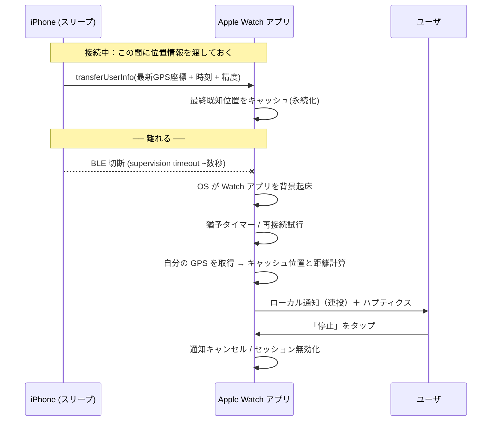
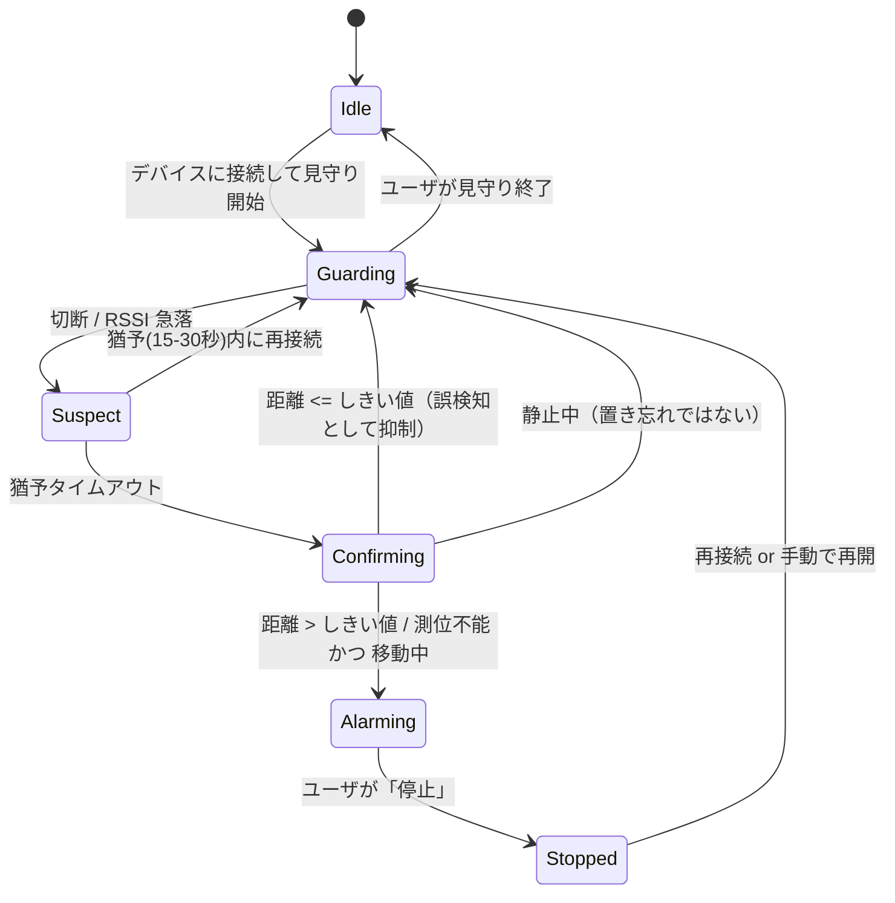

# iPhone スリープ中の Apple Watch アラーム — 方式検討

> 対象: `apple-watch/TuretetteWatch`（watchOS アプリ）+ 未実装の `ios/`（iPhone コンパニオン）
> 検討日: 2026-08-23 / 前提 watchOS 9.0+、iOS 16+

「iPhone がスリープ状態でも Apple Watch に通知を送り、ユーザが止めるまでアラームを鳴らす」
ための 2 方式（BLE 切断検知 / GPS 距離比較）を、watchOS の実際の制約に照らして検討する。

---

## 0. 結論（TL;DR）

1. **アラームの生成は必ず Apple Watch 側で行う。** iPhone 側からの通知は「iPhone と Watch が
   つながっている」ことが前提であり、切断・遠距離という今回の発報条件下では届かない（§1）。
   したがって iPhone の役割は「BLE ペリフェラルとして接続を維持する」「切れる前に自分の位置を
   Watch へ渡しておく」の 2 つに限定される。どちらもスリープ中のバックグラウンドで実行可能。
2. **方式1（BLE 切断）を一次トリガ、方式2（GPS 距離）を確証フィルタとして併用する**のが最良。
   方式1 は即応性が高いが誤検知が多く、方式2 は誤検知に強いが単独では Watch を起床できない
   （watchOS にはジオフェンス／大幅位置変更の API が存在しない、§2.2）。両者は補完関係にある。
3. **「止めるまで鳴らす」は単一 API では実現できない。** 段階的に鳴らし続ける多段設計が必要
   （§7）。entitlement 追加なしで実用になるのは「ローカル通知の連投 → ユーザ操作でアプリ前面化
   → Extended Runtime Session で無限ハプティクス」の組み合わせ。理想形は Critical Alerts
   entitlement の取得（Apple への個別申請が必要）。
4. **watchOS のバックグラウンド BLE 起床は 24 時間で 5 回**という厳しい予算がある（§2.1）。
   「切れたら即アラーム」を無条件に実装すると 1 日で予算を使い切るため、予算管理の設計が必須。
5. 現行コードには、この設計に進む前に直すべきバグ・無効設定が数点ある（§9）。

---

## 1. 大前提：通知はどちらの端末で作るのか

「iPhone がスリープ状態のとき」という条件から、まず通知の生成場所を決める必要がある。

| 経路 | 成立するか | 理由 |
|---|---|---|
| iPhone がローカル通知を出し、Watch へミラーリング | **不可** | 通知ミラーリングは iPhone↔Watch のリンク経由。方式1 の発報条件はそのリンクが切れた状態そのもの。方式2 でも「離れている」＝リンク圏外である可能性が高い |
| サーバから APNs で Watch へ直接プッシュ | 可能だが不適 | Watch が単独で Wi-Fi/セルラーに接続している必要があり、サーバ・アカウント基盤も必要。屋外・圏外で最も鳴ってほしい場面で落ちる |
| **Watch アプリが自分でローカル通知を出す** | **これしかない** | ネットワーク不要。検知も発報も Watch 内で完結する |

**帰結：検知ロジックとアラームは Watch 側に置く。** 現行の `BLEManager` / `AlarmManager` が
Watch 側にある構成は正しい。iPhone 側アプリは「ペリフェラル役」と「位置の事前送信役」に徹する。



---

## 2. プラットフォーム制約（調査結果）

設計判断の前提となる、公式ドキュメント / WWDC で確認した事実。

### 2.1 watchOS のバックグラウンド BLE

WWDC22「Get timely alerts from Bluetooth devices on watchOS」より。

| 項目 | 内容 |
|---|---|
| 必要な設定 | Watch アプリの Info.plist に `UIBackgroundModes = [bluetooth-central]`（iOS 側の capability UI ではなく Watch ターゲットの plist を直接編集する） |
| 動作要件 | **watchOS 9 以降 かつ Apple Watch Series 6 以降** |
| 起床のきっかけ | 接続済みペリフェラルからの **GATT characteristic の notify / indicate** |
| **背景実行の予算** | **24 時間のローリングウィンドウで 5 回**（watchOS 9） |
| 予算のリセット | ユーザがアプリを操作する、または 24 時間経過 |
| 1 回あたりの実行時間 | 「ごく短い」。ユーザに通知を出すには足りるが、重い処理は不可 |
| 予算枯渇時 | `LeGattExceededBackgroundNotificationLimit` が通知され、watchOS 8 相当の挙動（背景接続なし・Background App Refresh のみ）に戻る |
| 推奨 connection interval | 背景動作時は 150ms 以上 |
| 同時接続数 | watchOS は CoreBluetooth 接続 2 台まで |

> **設計上の含意**：「BLE イベントで起きて鳴らす」は 1 日 5 回しか保証されない。
> 誤検知で 1 回使うたびに、本当に必要な場面の弾が減る。§3.3 の誤検知抑制と、
> §6 の予算管理は必須。なお `didDisconnectPeripheral` による切断検知も同じ背景実行枠を
> 消費するとみなして設計するのが安全。

### 2.2 watchOS の位置情報 — ジオフェンスが使えない

「最後の位置から R メートル離れたら起床」というジオフェンス実装は **watchOS では不可能**。
主要 API の対応プラットフォームを確認した結果：

| API | watchOS | 備考 |
|---|---|---|
| `startMonitoring(for: CLRegion)`（ジオフェンス） | **非対応** | iOS / macOS のみ。iOS 27 で deprecated |
| `startMonitoringSignificantLocationChanges()` | **非対応** | iOS / macOS のみ |
| `CLMonitor` + `CircularGeographicCondition`（iOS 17+ の後継） | **非対応** | iOS のみ |
| `requestLocation()`（単発取得） | 対応 | 実行中のアプリからのみ |
| `startUpdatingLocation()` | 対応（watchOS 3.0+） | 背景継続には `allowsBackgroundLocationUpdates = true` + `WKBackgroundModes = [location]` |
| `CLBackgroundActivitySession` + `CLLocationUpdate.liveUpdates`（watchOS 10+） | 対応 | 前面で開始する必要あり。要実機検証 |

さらに `startUpdatingLocation()` の注意書きにあるとおり、**アプリがサスペンド／終了すると位置
イベントの配信は止まる**。iOS では Always 認可 + SLC / visits / region 監視があればアプリが
背景起動されるが、**watchOS にはその 3 つがどれも無い**。

> **設計上の含意**：方式2 は**単独では成立しない**。位置情報で Watch を叩き起こす手段が
> 無いため、方式2 は「何か別の理由で起きたときに、鳴らすべきかを判断する材料」として使う。
> 起床のきっかけは (a) BLE イベント、(b) Background App Refresh、(c) WatchConnectivity 受信、
> (d) ユーザの操作、のいずれかに限られる。

### 2.3 「鳴らし続ける」ための実行時間 — Extended Runtime Session

`WKExtendedRuntimeSession` は「アプリが前面でなくなっても動き続ける」ための唯一の正規手段。

| セッション種別 | `WKBackgroundModes` の値 | 実行形態 | 最大時間 | 予約可否 |
|---|---|---|---|---|
| Self care | `self-care` | 前面維持 | 10 分 | 不可 |
| Mindfulness | `mindfulness` | 前面維持 | 1 時間 | 不可 |
| Physical therapy | `physical-therapy` | バックグラウンド | 1 時間 | 不可 |
| Smart alarm | `alarm` | バックグラウンド | 30 分 | **可**（36 時間先まで） |
| （Workout） | `workout-processing` | バックグラウンド | 実質無制限 | — |

共通の制約：

- **拡張ランタイムのセッション種別はアプリごとに 1 つだけ**（`workout-processing` とは併用可）。
- **`start()` / `start(at:)` は必ず `WKApplicationState.active`（前面）で呼ぶ必要がある。**
- 画面が消えていても実行が続き、Bluetooth 通信・ハプティクス・サウンドを継続できる。
- `notifyUser(hapticType:repeatHandler:)` で**繰り返しハプティクス**を鳴らせる。
  `repeatHandler` が次回までの秒数を返す限り鳴り続けるため、「止めるまで鳴らす」を素直に書ける。
- Smart alarm は `start(at:)` で予約 → システムがアプリを再起動 → `notifyUser` を必ず呼ぶ必要が
  あり、呼ばないとシステムが警告を出して以後のセッションを無効化しようとする。

> **重要な帰結**：Smart alarm の再予約も「前面で」しか行えないため、
> 「30 分後の smart alarm を背景で予約し続けて常駐する」という設計は**成立しない**。
> Extended Runtime Session は「ユーザが前面で見守りを開始した」時点でのみ張れる。

### 2.4 通知でどこまで押し切れるか

| 手段 | 消音/集中モードの貫通 | 追加要件 |
|---|---|---|
| 通常のローカル通知 | しない | なし |
| `interruptionLevel = .timeSensitive` | 集中モードを貫通 | Time Sensitive Notifications capability（Xcode で自己付与可） |
| `interruptionLevel = .critical` + `UNNotificationSound.defaultCritical` | **消音スイッチ・おやすみモードも貫通、画面点灯、音量固定** | `com.apple.developer.usernotifications.critical-alerts` entitlement — [Apple への個別申請](https://developer.apple.com/contact/request/notifications-critical-alerts-entitlement/) が必要で、承認対象は極めて限定的。ユーザ許可も `.criticalAlert` オプションで別途取得 |

その他の実務上の制限：

- `UNTimeIntervalNotificationTrigger(timeInterval:repeats: true)` は **60 秒以上でないと繰り返せない**。
  数秒間隔で鳴らすには一発ごとに別リクエストを積む必要がある。
- **未配信の通知リクエストはアプリあたり 64 件が上限**（超過分は捨てられる）。
  例：5 秒間隔 × 60 件 ＝ 約 5 分間の鳴動が 1 バッチの限界。
- `UNNotificationCategory` にアクションを登録すれば、通知から直接「停止」を押せる。

### 2.5 WatchConnectivity

- Watch 側の `WCSession.isReachable` は、**iPhone アプリが起動していなくても、iPhone が圏内なら
  true** になる（Watch からの送信で iOS アプリが背景起動されるため）。
  → 「iPhone と離れた」の**補助シグナル**として使える。
  ただし `sessionReachabilityDidChange(_:)` は取りこぼし・誤発火の報告が多く、
  **一次トリガにはしない**。また Wi-Fi 経由でも到達するため、自宅内では圏内判定になりやすい。
- `transferUserInfo(_:)` は iPhone がスリープ中でもキューイングされて配信され、
  **Watch アプリを `WKWatchConnectivityRefreshBackgroundTask` で背景起床できる**。
  → 位置情報の事前共有はこれで行う（`updateApplicationContext` は上書きされるが最新値だけ欲しい
  今回の用途にはむしろ適する）。
- 既知の落とし穴：最初の `WKWatchConnectivityRefreshBackgroundTask` を受け取った後、
  以降のメッセージが既定のデリゲート経路で処理されてタスクが紐付かなくなることがある。
  `hasContentPending` を監視し、処理し終えてから `setTaskCompleted` すること。

---

## 3. 方式1：BLE 接続の切断で検知する

### 3.1 トポロジの選択

| 案 | 構成 | 評価 |
|---|---|---|
| **A（推奨）** | iPhone = `CBPeripheralManager`（アドバタイズ＋characteristic）、Watch = `CBCentral` として接続維持 | 接続を張りっぱなしにするので、iPhone がスリープでも OS が iOS アプリを起こしてくれる。切断は双方が数秒で検知。watchOS の背景 BLE 起床（§2.1）が効く唯一の構成 |
| B | `WCSession.isReachable` の変化を見る | 実装は最小。ただし信頼性が低く、Wi-Fi 経由でも到達扱いになるため自宅内では発報しない。**補助シグナル**に留める |
| C | Watch ⇔ BLE タグ（iPhone を介さない） | 現行実装の想定。タグ側の仕様に依存するが、notify を出せるタグなら A と同じ枠組みで動く |

案 A の iPhone 側要件：

- `UIBackgroundModes = [bluetooth-peripheral]`。バックグラウンドでのアドバタイズは
  サービス UUID が「オーバーフロー領域」に移り、ローカル名も載らない。
  **Watch 側はサービス UUID を明示してスキャンすること**（`scanForPeripherals(withServices:)`）。
- `CBPeripheralManagerOptionRestoreIdentifierKey` による状態復元を入れる。
  ただし**ユーザが手動でアプリを終了（スワイプで kill）した場合は OS が復帰させない**。
  この場合の救済は「Watch 側で接続できないことを検知して知らせる」しかない。
- Watch を起こすため、`CBMutableCharacteristic` に `.notify` を持たせ、
  接続中に定期的（例：数分に 1 回）または状態変化時に `updateValue` する。
  これが §2.1 の起床トリガになる。心拍のような高頻度更新は予算を焼き切るので厳禁。

### 3.2 検知の流れ

```
接続維持（Watch = Central）
  ├─ 正常時：ハートビート characteristic の notify を低頻度で受信
  ├─ 切断時：
  │    ├─ CBCentralManagerDelegate.centralManager(_:didDisconnectPeripheral:error:)
  │    │    → OS が Watch アプリを背景起床（State Restoration 経由）
  │    └─ 猶予フェーズへ
  └─ 猶予フェーズ（15〜30 秒）
       ├─ connect(peripheral) で自動再接続を試行（CoreBluetooth はタイムアウトなしで待つ）
       ├─ 再接続できた → 誤検知として破棄、監視へ復帰
       └─ 猶予切れ → 確証フェーズ（＝方式2）へ
```

BLE の切断検知そのものは、Link Layer の **supervision timeout（実測で概ね数秒）** で起きる。
即応性は十分。問題は精度側にある。

### 3.3 誤検知の要因と対策

BLE の切断は「離れた」以外の理由でも日常的に起きる。ここを潰さないと、
§2.1 の 5 回/24h 予算を誤報で使い切って肝心なときに鳴らないアプリになる。

| 切断の原因 | 見分け方 | 対応 |
|---|---|---|
| 電波の遮蔽・干渉（角を曲がった、体が挟まった） | 数秒で再接続できる | 猶予タイマー（15〜30 秒）で吸収 |
| iPhone の Bluetooth を OFF にした | 再接続要求が即失敗し続ける | 位置が近ければ鳴らさない（方式2 で確証） |
| iPhone の電池切れ・再起動 | 同上 | 同上。加えて「最後の受信から N 分」を通知文に含めて誤解を防ぐ |
| iPhone アプリがユーザに kill された | 復元されない | 前面復帰時に「見守りが止まっています」と警告 |
| **本当に置き忘れた／はぐれた** | 再接続不能 かつ 位置が離れている かつ ユーザが移動中 | **発報** |

追加の抑制条件（現行の `MotionManager` を活かす）：

- **ユーザが静止しているなら鳴らさない。** 置き忘れは「離れる」動作を伴う。
  `CMMotionActivity` が stationary のまま切れたのは、iPhone 側の都合である可能性が高い。
- **切断直前の RSSI トレンド**を見る。減衰しながら切れたなら距離起因、
  高 RSSI から突然切れたなら障害起因の可能性が高い。移動中央値でノイズを落として判定する。

---

## 4. 方式2：最後に報告された GPS 位置との距離で検知する

### 4.1 位置情報をどう渡すか（切れる前に渡しておく）

離れてからでは通信できないので、**接続中に継続的に最新位置を Watch へ push しておく**のが基本。

**iPhone 側（スリープ中でも動く経路）**

```swift
// 省電力：大幅位置変更のみ。サスペンド・強制終了後でもアプリを背景起動できる（iOS のみ）
locationManager.allowsBackgroundLocationUpdates = true
locationManager.startMonitoringSignificantLocationChanges()

func locationManager(_ m: CLLocationManager, didUpdateLocations locs: [CLLocation]) {
    guard let loc = locs.last else { return }
    WCSession.default.transferUserInfo([
        "lat": loc.coordinate.latitude,
        "lon": loc.coordinate.longitude,
        "acc": loc.horizontalAccuracy,   // 精度円の半径(m)
        "ts" : loc.timestamp.timeIntervalSince1970
    ])
}
```

- 大幅位置変更は概ね 500m / 数分の粒度。置き忘れ検知（数十〜数百 m 判定）には十分。
- 併せて、**BLE 接続中は characteristic の read でも現在位置を返せる**ようにしておくと、
  Watch 側が「切れる直前の値」を能動的に取りに行けて鮮度が上がる。
- 位置が動かない（＝iPhone が机の上にある）ときは SLC が発火しないので、
  「一定時間ごとに 1 回は送る」ハートビートも入れて鮮度と生存確認を兼ねる。

**Watch 側**

```swift
func session(_ s: WCSession, didReceiveUserInfo userInfo: [String: Any]) {
    LastKnownFix.save(from: userInfo)   // UserDefaults へ永続化（背景終了に耐える）
}
```

AppDelegate の `handle(_:)` に `WKWatchConnectivityRefreshBackgroundTask` の分岐を追加する
（現行コードには無い、§9）。

**BLE タグ（GPS 非搭載）の場合**：タグ自身は位置を報告できないので、
「**Watch がタグを最後に見た地点＝そのときの Watch の位置**」を最終既知位置として記録する。
接続中に定期的に Watch の位置を上書き保存しておけばよい。

### 4.2 Watch 側の距離判定

```swift
// 起床のきっかけがあったときにだけ 1 回取る（常時測位は電池を焼く）
locationManager.requestLocation()

func locationManager(_ m: CLLocationManager, didUpdateLocations locs: [CLLocation]) {
    guard let watchLoc = locs.last, let fix = LastKnownFix.load() else { return }

    let age = Date().timeIntervalSince(fix.timestamp)
    let raw = watchLoc.distance(from: fix.location)          // 大円距離(m)
    let margin = watchLoc.horizontalAccuracy + fix.accuracy  // 双方の精度円を差し引く
    let effective = raw - margin

    switch (effective, age) {
    case let (d, a) where d > threshold && a < maxAge:  fire()          // 確実に離れている
    case let (d, _) where d <= threshold:               suppress()      // 近い → 誤検知
    default:                                            fireCautiously() // 位置が古い → 文面を弱める
    }
}
```

判定パラメータの目安：

| パラメータ | 推奨値 | 根拠 |
|---|---|---|
| `threshold`（距離しきい値） | **100〜200 m**（ユーザ設定可） | Apple Watch の GPS 誤差は屋外で 5〜20 m、市街地や屋内ではそれ以上。BLE の 2m 判定と同じ感覚では誤検知だらけになる |
| `maxAge`（位置の鮮度） | 10 分 | SLC の粒度と釣り合う。これを超えたら「離れた」と断定せず注意喚起に留める |
| 測位タイムアウト | 15〜30 秒 | 屋内では測位に失敗する。失敗時は方式1 の判定にフォールバック |

### 4.3 方式2 の限界

- **単独で起床できない**（§2.2）。必ず方式1 か Background App Refresh に乗せる必要がある。
- 屋内・地下では測位できないか誤差が数百 m に膨らむ。`horizontalAccuracy` を見て、
  精度が悪すぎる（例：> 100 m）フィックスは判定に使わない。
- 測位そのものが電池を食う。**イベント駆動で単発取得**に徹し、常時測位はしない。
- 「iPhone を置いた場所で自分も座っている」ケースは距離 0 なので正しく鳴らない（望ましい挙動）。

---

## 5. 方式1 と方式2 の比較

| 観点 | 方式1（BLE 切断） | 方式2（GPS 距離） |
|---|---|---|
| 検知の速さ | 数秒（supervision timeout） | 位置更新の粒度に依存（数分） |
| 検知できる距離 | 約 10〜30 m（BLE 到達範囲） | しきい値次第（100 m〜） |
| Watch を起床できるか | **できる**（背景 BLE、5回/24h） | **できない**（watchOS にジオフェンス無し） |
| 誤検知しやすさ | 高い（遮蔽・干渉・電池切れ・Bluetooth OFF） | 低い（ただし測位失敗・精度劣化あり） |
| 屋内での信頼性 | 中（壁で切れやすい＝過検知） | 低（測位できない） |
| 電池消費 | 小（接続維持は安価） | 中〜大（測位のたびに GPS 起動） |
| iPhone スリープ中の可用性 | 可（BLE 背景モードで OS が起こす） | 可（SLC で背景起動 → transferUserInfo） |
| タグ（GPS 無し）対応 | そのまま可 | 「最後に見た地点」で代替可 |

**単独採用の可否**：方式1 は単独で成立するが誤報が多い。方式2 は単独では成立しない。
→ **方式1 で起きて、方式2 で確かめる**という組み合わせが唯一まともに動く構成。

---

## 6. 推奨アーキテクチャ：二段トリガ



各状態でやること：

| 状態 | Watch がやること | 消費する背景予算 |
|---|---|---|
| Guarding | BLE 接続維持、低頻度 notify 受信、位置キャッシュ更新 | ハートビート 1 回 |
| Suspect | 再接続試行、猶予タイマー。この間は無音 | 切断起床 1 回 |
| Confirming | `requestLocation()`、`WCSession.isReachable` 確認、モーション状態確認 | 同じ起床枠の中で完結させる |
| Alarming | 通知連投 ＋（前面化後）Extended Runtime Session でハプティクス継続 | — |

**背景予算（5 回/24h）の管理**

- `LeGattNearBackgroundNotificationLimit` / `LeGattExceededBackgroundNotificationLimit` を購読し、
  残弾が少ないときは「切断即起床」をやめて Background App Refresh 主体に落とす。
- 予算はユーザ操作でリセットされるので、アラーム停止操作そのものが回復の契機になる。
- 残弾切れの状態を UI に出す（「省電力のため検知間隔が長くなっています」）。

**強化モード（任意）**：ユーザが前面で「これから 1 時間見守る」と明示的に開始した場合に限り、
`WKExtendedRuntimeSession`（physical-therapy = 背景 1 時間）を張れば、予算に縛られず
確実に監視できる。通勤・買い物の 1 時間をカバーする用途に合う。ただし §10 の審査リスクあり。

---

## 7. 「ユーザが止めるまで鳴らす」の実装

単一の API では実現できないため、3 段構えにする。

### 段階 1：即時のローカル通知（Watch 上で完結）

```swift
let content = UNMutableNotificationContent()
content.title = "iPhone が離れました"
content.body  = "最後の位置から 180m。置き忘れていませんか？"
content.sound = .default
content.interruptionLevel = .timeSensitive   // 集中モードを貫通
content.categoryIdentifier = "TURETETTE_ALARM"  // 「停止」アクション付き
content.threadIdentifier   = "turetette.alarm"  // 通知センターで束ねる
```

### 段階 2：通知の連投で鳴らし続ける

`repeats: true` は 60 秒以上でないと使えず、未配信リクエストは 64 件が上限なので、
**短い間隔の一発通知を積む**。

```swift
// 5 秒間隔 × 48 発 ≒ 4 分間鳴り続ける（64 件上限に余裕を残す）
for i in 0..<48 {
    let trigger = UNTimeIntervalNotificationTrigger(
        timeInterval: TimeInterval(1 + i * 5), repeats: false)
    center.add(UNNotificationRequest(
        identifier: "turetette.alarm.\(i)", content: content, trigger: trigger))
}
```

- 「停止」時は `removePendingNotificationRequests` と `removeDeliveredNotifications` の両方を、
  **全 ID に対して**呼ぶ（現行実装は ID 1 個しか消していない、§9）。
- 1 バッチが尽きる前にアプリが背景で生きていれば次バッチを積み直す。生きていない場合は
  段階 3 に委ねる。
- 通知センターが 48 件で埋まるので、`threadIdentifier` で束ね、停止時に必ず全消しする。

### 段階 3：アプリ前面化後の無限ハプティクス

ユーザが通知をタップする／手首を上げてアプリが前面に来たら、**そこで初めて**
Extended Runtime Session を張れる（`start()` は前面でしか呼べない、§2.3）。

```swift
final class AlarmRuntime: NSObject, WKExtendedRuntimeSessionDelegate {
    private var session: WKExtendedRuntimeSession?

    func begin() {                       // 必ず WKApplicationState.active で呼ぶ
        let s = WKExtendedRuntimeSession()
        s.delegate = self
        s.start()
        session = s
    }

    func extendedRuntimeSessionDidStart(_ s: WKExtendedRuntimeSession) {
        // 止めるまで 2 秒おきに鳴らし続ける
        s.notifyUser(hapticType: .notification) { type in
            type.pointee = .notification
            return 2.0                   // 次回までの秒数。返し続ける限り継続
        }
    }

    func stop() { session?.invalidate(); session = nil }
}
```

これにより**画面が消えてもハプティクスが継続**し、「停止」を押すまで鳴り続ける
（セッション上限まで：physical-therapy / mindfulness なら 1 時間）。

### 段階 0（理想形）：Critical Alert

`com.apple.developer.usernotifications.critical-alerts` を取得できれば、
消音・おやすみモードを貫通し、画面を点灯させ、固定音量で鳴らせる。
本アプリの用途（置き忘れ・はぐれ防止＝安全）は申請の名目としては筋が通るが、
**承認対象は極めて限定的**なので、これ**前提の設計にはしない**。段階 1〜3 に上乗せする位置づけ。

### 手段の比較

| 手段 | 画面消灯時 | 継続時間 | 追加要件 | 審査/申請リスク |
|---|---|---|---|---|
| ローカル通知 1 発 | ○ | 単発 | なし | 低 |
| 通知の連投（48〜64 発） | ○ | 実質 4〜5 分/バッチ | なし | 低 |
| Time Sensitive | ○（集中モード貫通） | 同上 | capability 自己付与 | 低 |
| Critical Alert | ○（消音も貫通） | 同上 | **Apple への申請** | 高（承認制） |
| 前面 + `Timer` + `WKInterfaceDevice.play()` | **×**（消灯で停止） | 前面の間だけ | なし | 低 |
| Extended Runtime（physical-therapy 等） | ○ | 最大 1 時間 | `WKBackgroundModes`、前面で開始 | 中（用途との整合） |
| Extended Runtime（smart alarm） | ○ | 30 分 | 前面で 36h 以内を予約 | 中（イベント駆動に不向き） |
| `HKWorkoutSession` 常駐 | ○ | 実質無制限 | `workout-processing` | **高**（電池・アクティビティ汚染・審査） |

> 現行の `AlarmManager` は「前面で Timer + `play()`」＋「背景ならローカル通知 1 発」なので、
> **画面が消えた瞬間に鳴り止む**。要件「止めるまで鳴らす」を満たしていない。

---

## 8. 実装タスク（分解）

### Watch アプリ

| # | 内容 | 対象 |
|---|---|---|
| 1 | `WKBackgroundModes` の無効値 `self-contained` を除去（§9-1） | `Info.plist` |
| 2 | 位置情報の使用目的説明 `NSLocationWhenInUseUsageDescription` 追加 | `Info.plist` |
| 3 | 背景スキャン用にサービス UUID を定義し `scanForPeripherals(withServices:)` へ変更 | `BLEManager` |
| 4 | 復帰時の再接続を `retrievePeripherals(withIdentifiers:)` ベースに変更 | `BLEManager` |
| 5 | RSSI の移動中央値フィルタ＋適応ポーリング（前面 1s / 背景はイベント駆動） | `BLEManager` |
| 6 | 背景予算の監視（`LeGattNear/Exceeded...` 通知の購読） | `BLEManager` |
| 7 | **新規** 状態機械（Guarding/Suspect/Confirming/Alarming）と猶予タイマー | `ProximityCoordinator`（新規） |
| 8 | **新規** 単発測位と距離判定 | `LocationManager`（新規） |
| 9 | **新規** `WCSession` 受信と最終既知位置の永続化 | `ConnectivityManager` / `LastKnownFix`（新規） |
| 10 | `handle(_:)` に `WKWatchConnectivityRefreshBackgroundTask` 分岐を追加 | `AppDelegate` |
| 11 | 通知連投＋全 ID 一括キャンセル、`UNNotificationCategory`（停止アクション） | `AlarmManager` |
| 12 | `WKExtendedRuntimeSession` によるハプティクス継続 | `AlarmManager` |
| 13 | アラーム状態の永続化（背景終了しても復帰時に鳴動継続） | `AlarmManager` |
| 14 | しきい値（距離・猶予秒数）の設定画面 | `Views/`（新規） |

### iPhone アプリ（新規 `ios/`）

| # | 内容 |
|---|---|
| 1 | `CBPeripheralManager`：サービス/characteristic 公開、`bluetooth-peripheral` 背景モード、状態復元 |
| 2 | 低頻度ハートビート notify（Watch の背景起床トリガー、間隔は予算と要相談） |
| 3 | `startMonitoringSignificantLocationChanges()` + `transferUserInfo` で位置を Watch へ push |
| 4 | 位置 characteristic の read 対応（Watch から能動取得できるように） |
| 5 | `WKCompanionAppBundleIdentifier`（現在 `com.turetette`）と Bundle ID を一致させる |

---

## 9. 現行コードで先に直すべき点

1. **`WKBackgroundModes = [self-contained]` は無効値。** 正当な値は `workout-processing` /
   `self-care` / `mindfulness` / `physical-therapy` / `alarm` / `underwater-depth` のみ。
   Background App Refresh 自体はこのキー無しでも使えるので、いまは削除でよい。
   Extended Runtime Session を導入する段で適切な値を入れる。
2. **`BLEManager.performBackgroundRSSICheck()` の未接続分岐が発火しない。**
   `didDisconnectPeripheral` で `isOutOfRange = false` にリセットしているため、
   その後の `if isOutOfRange { sendOutOfRangeNotification(...) }` は常に false。
   「切れている」ことと「離れている」ことを別のフラグに分離する必要がある。
3. **`scanForPeripherals(withServices: nil)` は背景では動作しない。** 背景スキャンには
   サービス UUID の明示が必須。State Restoration 後の復帰も
   `retrievePeripherals(withIdentifiers:)` で行うべき。
4. **`Timer` ベースの 1 秒 RSSI ポーリングは背景で止まる**うえ、前面でも電池に厳しい。
   イベント駆動＋適応間隔に変更する。
5. **単発 RSSI での距離判定はノイズが大きい。** 2m しきい値を素の RSSI 1 サンプルで
   判定すると頻繁に振動する。中央値フィルタ＋ヒステリシス（例：出 2.5m / 復帰 1.5m）を入れる。
6. **`AlarmManager` の通知は 1 発のみ**＝「止めるまで鳴る」を満たさない（§7）。
7. **アラーム状態が永続化されていない。** 背景でアプリが終了されると `isAlarmActive` が
   失われ、前面復帰時にハプティクスが再開されない。
8. `ContentView` の `.onReceive` 経由の発火は前面前提。実際の発報経路は
   `ProximityCoordinator` に集約し、View は表示だけにするのが望ましい。

---

## 10. 未検証事項・リスク

| # | 項目 | 内容 |
|---|---|---|
| 1 | 実機検証が必須 | 背景 BLE / WatchConnectivity はシミュレータで再現しない。Series 6 以降の実機が必要 |
| 2 | 切断イベントの予算消費 | 「5 回/24h」が notify 起床のみを数えるのか、`didDisconnect` 起床も含むのかは実測で確認する |
| 3 | Extended Runtime の種別と審査 | 置き忘れ防止アプリで `mindfulness` / `physical-therapy` を宣言するのは用途との整合性に難がある。App Review で指摘される可能性を織り込む。`alarm`（smart alarm）は意味的には近いが予約型でイベント駆動に使えない |
| 4 | Critical Alerts の承認 | 申請が通る保証はない。通らない前提の設計（§7 段階 1〜3）を主線にする |
| 5 | `CLBackgroundActivitySession`（watchOS 10+） | 背景測位の維持に使えるか未検証。使えるなら方式2 の自立性が上がる |
| 6 | iPhone の背景アドバタイズ | オーバーフロー領域の挙動は端末・OS 版で差がある。接続維持で回避する設計にしているが要実測 |
| 7 | 電池影響 | BLE 接続維持は安価だが、GPS 単発測位と通知連投は重い。1 日あたりの実測が必要 |
| 8 | プライバシー表示 | 位置情報の取得目的を Info.plist と App Store のプライバシー項目に正しく記載する（現状 README は「位置情報は使わない」と明記しているため、方式2 採用時は文言の更新が必要） |

---

## 11. 参考資料

- [Get timely alerts from Bluetooth devices on watchOS — WWDC22](https://developer.apple.com/videos/play/wwdc2022/10135/)
- [Connect Bluetooth devices to Apple Watch — WWDC21](https://developer.apple.com/videos/play/wwdc2021/10005/)
- [WKExtendedRuntimeSession](https://developer.apple.com/documentation/watchkit/wkextendedruntimesession)
- [Using extended runtime sessions](https://developer.apple.com/documentation/watchkit/using-extended-runtime-sessions)
- [WKBackgroundModes](https://developer.apple.com/documentation/bundleresources/information-property-list/wkbackgroundmodes)
- [WKWatchConnectivityRefreshBackgroundTask](https://developer.apple.com/documentation/watchkit/wkwatchconnectivityrefreshbackgroundtask)
- [UNNotificationInterruptionLevel](https://developer.apple.com/documentation/usernotifications/unnotificationinterruptionlevel)
- [Critical Alerts entitlement](https://developer.apple.com/documentation/bundleresources/entitlements/com.apple.developer.usernotifications.critical-alerts) / [申請フォーム](https://developer.apple.com/contact/request/notifications-critical-alerts-entitlement/)
- [CLLocationManager.startMonitoring(for:)](https://developer.apple.com/documentation/corelocation/cllocationmanager/startmonitoring(for:))（watchOS 非対応）
- [CLLocationManager.startUpdatingLocation()](https://developer.apple.com/documentation/corelocation/cllocationmanager/startupdatinglocation())（watchOS 3.0+）
- [CLMonitor は watchOS 非対応 — Apple Developer Forums](https://developer.apple.com/forums/thread/731517)
